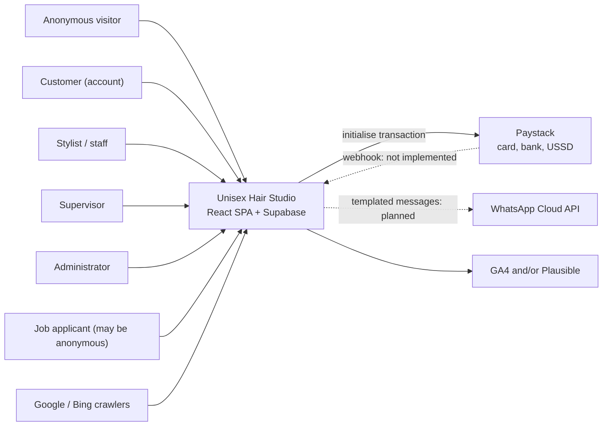
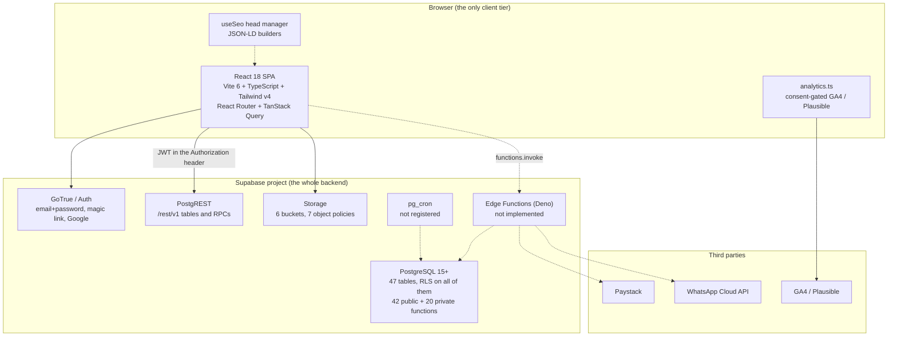
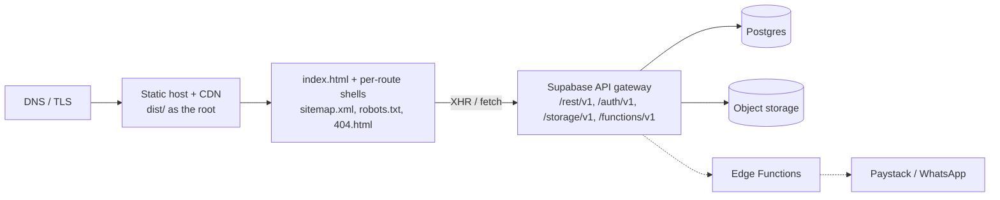

# 01 · System architecture

## Context

Unisex Hair Studio is a single-platform salon business: a marketing and discovery site, a booking
engine with a client requirement form, a small commerce operation selling the hair it installs, a
recruitment pipeline, and the internal tools staff and administrators use to run the day. All of it
is served by one static single-page application talking to one Supabase project.



Four audiences share one codebase and one database, separated by role rather than by deployment.

## Container



Solid arrows are implemented. Dashed arrows are contracts that exist in code or design but have no
working server-side implementation yet.

There is no application server, no container to deploy and no bespoke API layer. The Supabase project
is the backend, and the browser is the only place application logic lives outside SQL.

## Application surfaces

The route table lives in `src/App.tsx`. Every page is `React.lazy` imported, so an anonymous visitor
never downloads a dashboard chunk.

### Public site — `SiteLayout` (`src/components/layout/SiteLayout.tsx`)

Header, `<main id="main">`, footer, `ScrollRestoration`. The marketing shell. Authentication pages
deliberately sit inside it rather than in their own shell.

| Route | Page | Notes |
| --- | --- | --- |
| `/` | `src/pages/HomePage.tsx` | Hero, featured services, gallery rail, testimonials, FAQs. |
| `/about` | `AboutPage` | Story plus the public stylist directory (`staff_public`). |
| `/services` | `ServicesPage` | Filterable catalogue from `service_catalog`. |
| `/services/:slug` | `ServiceDetailPage` | Pricing, duration, aftercare, `Service` JSON-LD. |
| `/book` | `features/booking/BookingPage` | The booking wizard; no guard — the wizard prompts. |
| `/book/confirmed/:reference` | `BookingConfirmationPage` | Reference lookup. |
| `/shop`, `/shop/:slug` | `features/shop/*` | Product list and detail from `product_catalog`. |
| `/cart` | `features/cart/CartPage` | Works for guests via a `localStorage` session token. |
| `/gallery` | `GalleryPage` | Published `gallery_items`, with before/after pairs. |
| `/careers`, `/careers/:slug`, `/careers/:slug/apply` | `CareersPage`, `JobDetailPage`, `JobApplyPage` | `JobPosting` JSON-LD; application form uploads a CV to the private `applications` bucket. |
| `/contact` | `ContactPage` | Address, opening hours, WhatsApp deep link. |
| `/search` | `SearchPage` | Client-side filter over already-fetched catalogue rows. |
| `/policies/:slug` | `PolicyPage` | CMS pages from `pages`, with per-page `noindex`. |
| `/auth/*` | `features/auth/pages/*` | Sign in, sign up, forgot/reset password, email-confirm landing. |

### Customer account — `RequireAuth` + `DashboardLayout`, path prefix `/account`

`AccountOverviewPage`, `AccountAppointmentsPage`, `AppointmentDetailPage`, `AccountOrdersPage`,
`OrderDetailPage`, `WishlistPage`, `ProfilePage`, `NotificationsPage`, `MyApplicationsPage`.

Every query here is scoped by RLS to `customer_id = auth.uid()`; the page never passes a customer id
it did not receive from the session.

### Staff — `RequireAuth` + `RequireRole(['staff','supervisor','admin'])`, prefix `/staff`

`StaffTodayPage` (today's chair), `StaffDiaryPage` (date-ranged diary), `StaffRequirementsPage`
(requirements queue for assigned clients), `StaffClientsPage`.

`admin.ts:getDiary` filters by `staff_id`, and `appointments_select_participants` already restricts a
stylist to their own rows, so a stylist cannot read a colleague's diary even by editing the request.

### Administration — `RequireAuth` + `RequireRole(['admin'])`, prefix `/admin`

`AdminDashboardPage` (`fn_admin_dashboard_stats`), `AdminBookingsPage`, `AdminBookingDetailPage`,
`AdminServicesPage`, `AdminProductsPage`, `AdminProductEditPage`, `AdminInventoryPage`,
`AdminOrdersPage`, `AdminOrderDetailPage`, `AdminCustomersPage`, `AdminCareersPage`,
`AdminApplicationsPage`, `AdminApplicationDetailPage`.

`DashboardLayout` derives its sidebar from `isAdmin` / `isStaff`, so the navigation a user sees is a
function of their role keys. As with the guards, that is presentation; the policies decide.

## The SPA and Supabase split

The rule the codebase follows is: **the browser renders and collects; Postgres decides.**

The browser owns:

- routing, layout, code splitting and the Suspense boundaries;
- the document head (`useSeo`) and structured data;
- optimistic UI state, toasts, dialogs, form validation (`react-hook-form` + `zod`);
- the cart session token in `localStorage`, because a guest has no session;
- consent for analytics.

Postgres owns:

- every authorisation decision (91 policies plus the helpers they call);
- every calculation that involves money, stock or a date window;
- every state transition, with the legal graph enforced in plpgsql;
- every derived value (`balance_due`, ratings, daily slot counts);
- the append-only ledgers (`inventory_movements`, `appointment_status_history`,
  `application_events`, `audit_log`).

`src/lib/api/` is the only place that builds a query. `db.ts` unwraps `{ data, error }` into thrown
`ApiError`s so no component ever sees a PostgREST envelope, and `index.ts` re-exports a single
barrel so nothing imports a deep path.

## Request lifecycle

```mermaid
sequenceDiagram
  autonumber
  participant U as User
  participant R as React route
  participant Q as TanStack Query
  participant S as supabase-js
  participant G as GoTrue
  participant P as PostgREST
  participant D as Postgres

  U->>R: navigates (or clicks a CTA)
  R->>Q: useQuery({ queryKey: qk.x(), queryFn })
  Q->>S: cached? return : fetch
  S->>P: GET /rest/v1/<table>?select=... with JWT
  P->>D: query with auth.uid() from the JWT `sub` claim
  D->>D: RLS policies evaluate (USING / WITH CHECK)
  alt row passes the policy
    D-->>P: rows
  else no row passes
    D-->>P: empty set
  end
  P-->>S: 200 + JSON
  S-->>Q: typed value
  Q-->>R: data (or thrown ApiError)
  R->>R: render loading / error / empty / data
  Note over R,D: writes take the same path but land on a
  SECURITY DEFINER function, which re-authorises and
  performs its own row-level checks
```

Three things are worth calling out in that diagram.

**The JWT carries the identity.** `auth.uid()` reads the `sub` claim, which PostgREST sets from the
bearer token. No policy ever accepts a caller-supplied user id, so "acting as someone else" is not
expressible in a request.

**Deny by default.** RLS is enabled on all 47 tables. A table with no matching policy returns zero
rows, so a forgotten grant fails closed rather than open.

**Writes are functions, not row updates.** `fn_create_appointment`, `fn_checkout`,
`fn_set_appointment_status`, `fn_cancel_appointment`, `fn_reschedule_appointment`,
`fn_adjust_stock`, `fn_record_offline_payment`, `fn_set_order_status`,
`fn_set_application_status` and `fn_withdraw_application` are all `SECURITY DEFINER` with a locked
`search_path`. They run as the owner, which means they must re-check authorisation themselves —
and each one does. Column-guard triggers then block the fields even a permitted row-level update must
not touch; see [06](./06-rls-and-permissions.md).

## Trust boundaries

| Boundary | What crosses it | What is enforced |
| --- | --- | --- |
| Browser ↔ internet | HTML, JS bundle, fonts, images | TLS, CSP (host configuration, not in the repo), bundle integrity via hashed asset names. |
| Browser ↔ PostgREST | Queries carrying the anon key, plus a JWT when signed in | The anon key is public by design. It is not a credential. |
| anon JWT ↔ authenticated JWT | `Authorization: Bearer <jwt>` | GoTrue signature and expiry; `auth.uid()` is derived from the verified `sub`. |
| authenticated user ↔ privileged function | `rpc('/rest/v1/rpc/fn_create_appointment', ...)` | The function re-authorises with `app_private.is_staff_or_admin(auth.uid())` and friends. |
| application ↔ `service_role` | Edge Function and SQL-editor sessions only | `service_role` has `BYPASSRLS` (granted in migration 0012). It is never in the bundle. |
| `public` schema ↔ `app_private` schema | Internal helpers | `app_private` is revoked from `public`, `anon` and `authenticated` in migration 0001, and every function in it is revoked again in 0012. |
| Private storage ↔ public | Reference images, CVs | The `requirements` and `applications` buckets are `public = false`; reads require a policy match and are served as short-lived signed URLs. |
| Payment provider ↔ platform | Webhook callbacks | **Not implemented.** `payments.provider_reference` and the `payment_events` idempotency table exist for it. |

A note on the anon key: because the anon key is embedded in the bundle, anyone can read it. The
schema is built on the assumption that they will, and the design response is that nothing sensitive
is reachable with it. The one place that assumption is not currently held is documented in
[06 · Known gaps](./06-rls-and-permissions.md#known-gaps).

## Deployment topology



The build is `npm run build` → `tsc -b --noEmit` → `vite build` → `npm run seo:generate`. The last
step reads `dist/index.html` and writes `sitemap.xml`, `robots.txt` and one prerendered
`<route>/index.html` shell per indexable route. See [10](./10-seo-and-analytics.md).

`vite.config.ts` sets `target: 'es2022'`, `cssTarget: 'chrome110'`, and splits vendor chunks into
`react`, `supabase`, `query`, `charts` and `forms` so a marketing visit never downloads the chart
bundle. `build.reportCompressedSize` is off and `chunkSizeWarningLimit` is 900 kB; a typical entry
chunk is well under that.

Hosting requirements are minimal: any static host that serves directory `index.html` for extensionless
paths (or an explicit rewrite to `/index.html`). The prerendered shells mean even a crawler that
ignores JavaScript gets a correct title, description, canonical and JSON-LD.

Environment configuration is entirely `VITE_*` variables in `.env.local`, read once at build time by
`src/config/env.ts`. Nothing secret may go in a `VITE_` variable: the build inlines them into the
bundle. Paystack secret keys and WhatsApp tokens belong in Edge Function environment variables.

## Supabase features in use

| Feature | Used for | Status |
| --- | --- | --- |
| **Auth (GoTrue)** | Signup, sign in, magic-link OTP, Google OAuth, password reset, email confirmation, session persistence and refresh. Client: `src/features/auth/AuthProvider.tsx`. | Implemented. Local config in `supabase/config.toml`; Google is disabled there and must be enabled per project. |
| **PostgreSQL** | The entire domain model and all business logic: 47 tables, 42 public functions, 20 private functions, 22 enums, 152 indexes. | Implemented. |
| **Row Level Security** | The authorisation boundary. Enabled on all 47 tables; 91 public-schema policies plus 7 `storage.objects` policies. | Implemented. |
| **`SECURITY DEFINER` functions** | Every privileged write path and every cross-owner read. Locked `search_path` on each. | Implemented. |
| **Public views** | `staff_public`, `service_catalog`, `product_catalog` — narrow, column-filtered reads for anonymous traffic. Created `security_invoker = false`. | Implemented. |
| **Storage** | Six buckets: `service-images`, `gallery`, `products` (public, media); `requirements`, `applications` (private, personal data); `avatars` (public, self-service). Buckets are created in migration 0014 so local and hosted match. | Implemented. Only the three private/self-service buckets have client write policies. |
| **Edge Functions** | Paystack initialisation, bank-transfer instructions, payment webhook handling, notification dispatch, WhatsApp sending. Invoked by name from `src/lib/api/commerce.ts` and `src/lib/supabase/client.ts`. | **Not implemented.** No `supabase/functions/` directory exists. Contracts are specified in [04](./04-api-specification.md). `vite.config.ts` proxies `/functions` in dev. |
| **pg_cron** | `app_private.housekeeping()` (expired holds, finished jobs, stale notifications) and `app_private.claim_scheduled_jobs()` as the job-queue pump. | **Not registered.** The functions exist; the two `cron.schedule` statements are commented out at the end of `supabase/config.toml`. |
| **pg_net** | Would be how pg_cron reaches an Edge Function. | Not used. |
| **Realtime** | Would let a second browser tab see a diary or stock level change live. | **Not used.** The client sets realtime transport params in `src/lib/supabase/client.ts` and subscribes to no channel; no publication is configured. `config.toml` enables the local service. |
| **Auth Hooks / custom claims** | Would put roles in the JWT so policies skip a lookup. | Not used. Roles are read from `user_roles` via `fn_my_role_keys()` and the `app_private.has_role()` helpers. |
| **Analytics (hosted)** | Supabase's own product analytics. | Disabled in `config.toml`. Site analytics are GA4/Plausible in the browser, not Supabase. |
| **GraphQL (`graphql_public`)** | Listed in the local `schemas` array. | Not used; the client is PostgREST-only. |

## Next

- Schema and invariants: [02 · Database schema](./02-database-schema.md)
- End-to-end sequences with permission decisions: [03 · User flows](./03-user-flows.md)
- The function-by-function surface: [04 · API specification](./04-api-specification.md)
