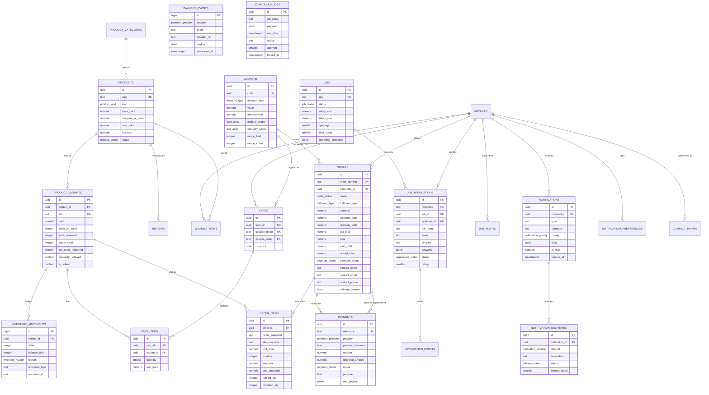

# 02 · Database schema

Seventeen migrations, 5,930 lines, 47 tables, 22 enums, 152 indexes, 42 public functions, 20 private
functions, 28 triggers and 91 public-schema RLS policies. This document organises the tables by
domain, then explains the design decisions and the invariants each domain enforces.

| Migration | File | Contents |
| --- | --- | --- |
| 0001 | `20250101000001_extensions_and_enums.sql` | `pg_trgm`, the 22 enum types, the `app_private` schema. |
| 0002 | `20250101000002_identity.sql` | Profiles, roles, staff, locations, singleton settings, audit log. |
| 0003 | `20250101000003_content.sql` | Service taxonomy, services, variants, staff capability map, gallery, reviews, CMS pages, FAQs, message templates. |
| 0004 | `20250101000004_booking.sql` | `btree_gist`, hours, staff rules, time off, blackouts, appointments, status history, holds, requirements, requirement media. |
| 0005 | `20250101000005_commerce.sql` | Products, variants, inventory ledger, wishlist, carts, coupons, orders, order lines, payments, payment events. |
| 0006 | `20250101000006_recruitment.sql` | Jobs, applications, pipeline events, job alerts. |
| 0007 | `20250101000007_notifications.sql` | Inbox, deliveries, preferences, contact points, scheduled jobs, WhatsApp log. |
| 0008 | `20250101000008_functions_auth.sql` | Role helpers, reference generator, `fn_handle_new_user`, rating rollups. |
| 0009 | `20250101000009_availability.sql` | `fn_service_slots` and the whole booking write path. |
| 0010 | `20250101000010_commerce_engine.sql` | Inventory, cart, coupon and checkout functions. |
| 0011 | `20250101000011_notifications.sql` | `fn_notify`, lifecycle notifiers, job-queue maintenance, dashboard aggregates. |
| 0012 | `20250101000012_rls.sql` | Public views, RLS on every table, all policies, all grants. |
| 0013 | `20250101000013_public_rpcs.sql` | Guest cart reads, coupon application, application submission, admin transitions. |
| 0014 | `20250101000014_triggers_storage.sql` | Triggers, column guards, storage buckets and object policies, housekeeping. |
| 0015 | `20250101000015_seed.sql` | Idempotent reference content: roles, location, 7 categories, 17 services, variants, 10 products, coupons, 3 vacancies, 9 FAQs, 6 templates. |
| 0016 | `20250101000016_candidate_selfservice.sql` | `fn_withdraw_application`. |
| 0017 | `20250101000017_edge_function_support.sql` | `claim_notification_deliveries`, `recover_stuck_deliveries`, `service_role` grants, `revoke insert on payments`. |

---

## Domain map

| Domain | Tables | Count |
| --- | --- | --- |
| Identity and tenancy | `profiles`, `roles`, `user_roles`, `staff_profiles`, `salon_locations`, `business_settings`, `audit_log` | 7 |
| Content and catalogue | `service_categories`, `services`, `service_variants`, `staff_services`, `gallery_items`, `reviews`, `pages`, `faqs`, `message_templates` | 9 |
| Booking and availability | `location_hours`, `staff_availability_rules`, `staff_time_off`, `blackout_dates`, `appointments`, `appointment_status_history`, `booking_holds`, `requirements`, `requirement_media` | 9 |
| Commerce | `product_categories`, `products`, `product_variants`, `inventory_movements`, `wishlist_items`, `carts`, `cart_items`, `coupons`, `orders`, `order_items`, `payments`, `payment_events` | 12 |
| Recruitment | `jobs`, `job_applications`, `application_events`, `job_alerts` | 4 |
| Notifications and system | `notifications`, `notification_deliveries`, `notification_preferences`, `contact_points`, `scheduled_jobs`, `whatsapp_messages` | 6 |
| | | **47** |

---

## ER diagrams

### Identity, content and booking

```mermaid
erDiagram
  AUTH_USERS ||--|| PROFILES : "on_auth_user_created"
  PROFILES ||--o| STAFF_PROFILES : "staff extension"
  PROFILES ||--o{ USER_ROLES : "grants"
  ROLES ||--o{ USER_ROLES : "granted as"
  ROLES ||--o{ USER_ROLES : "granted by"
  SALON_LOCATIONS ||--o{ LOCATION_HOURS : "opens"
  SALON_LOCATIONS ||--o{ BLACKOUT_DATES : "closed"
  BUSINESS_SETTINGS ||--|| PROFILES : "singleton policy"

  SERVICE_CATEGORIES ||--o{ SERVICES : "groups"
  SERVICES ||--o{ SERVICE_VARIANTS : "priced by"
  STAFF_PROFILES ||--o{ STAFF_SERVICES : "can perform"
  SERVICES ||--o{ STAFF_SERVICES : "capability"
  STAFF_PROFILES ||--o{ STAFF_AVAILABILITY_RULES : "works"
  STAFF_PROFILES ||--o{ STAFF_TIME_OFF : "away"

  PROFILES ||--o{ APPOINTMENTS : "books"
  SERVICES ||--o{ APPOINTMENTS : "is for"
  SERVICE_VARIANTS ||--o{ APPOINTMENTS : "priced by"
  STAFF_PROFILES ||--o{ APPOINTMENTS : "performs"
  SALON_LOCATIONS ||--o{ APPOINTMENTS : "at"
  APPOINTMENTS ||--o| REQUIREMENTS : "captures"
  REQUIREMENTS ||--o{ REQUIREMENT_MEDIA : "attaches"
  APPOINTMENTS ||--o{ APPOINTMENT_STATUS_HISTORY : "audits"
  APPOINTMENTS ||--o{ BOOKING_HOLDS : "held before"
  APPOINTMENTS ||--o{ PAYMENTS : "settled by"
  APPOINTMENTS ||--o{ REVIEWS : "reviewed by"

  PROFILES {
    uuid id PK
    text email
    text slug UK
    text full_name
    user_gender gender
    hair_class hair_class
    hair_texture hair_texture
    text_array allergies
    boolean marketing_opt_in
    boolean whatsapp_opt_in
    boolean sms_opt_in
    boolean email_opt_in
    text status
  }
  ROLES {
    smallserial id PK
    text key UK
    text_array capabilities
    smallint rank
    boolean is_system
  }
  USER_ROLES {
    uuid user_id PK_FK
    smallint role_id PK_FK
    uuid granted_by FK
    timestamptz expires_at
  }
  STAFF_PROFILES {
    uuid user_id PK_FK
    text title
    text_array specialities
    numeric commission_pct
    numeric hourly_rate
    boolean is_bookable
    smallint max_daily_bookings
    date employment_end_on
  }
  SALON_LOCATIONS {
    uuid id PK
    text slug UK
    text timezone
    boolean is_primary
    boolean is_active
  }
  BUSINESS_SETTINGS {
    boolean id PK
    numeric tax_pct
    boolean tax_inclusive
    smallint booking_lead_time_hours
    smallint max_advance_days
    smallint min_notice_hours
    smallint cancellation_window_hours
    smallint deposit_pct
    numeric free_delivery_threshold
  }
  SERVICES {
    uuid id PK
    text slug UK
    text summary
    integer duration_minutes
    integer buffer_minutes
    numeric price_from
    numeric price_to
    text price_unit
    boolean requires_requirement
    user_gender gender_restriction
    text status
  }
  STAFF_AVAILABILITY_RULES {
    uuid id PK
    uuid staff_id FK
    smallint weekday
    time starts_at
    time ends_at
    date effective_from
    date effective_to
  }
  STAFF_TIME_OFF {
    uuid id PK
    uuid staff_id FK
    time_off_kind kind
    timestamptz starts_at
    timestamptz ends_at
    boolean is_approved
  }
  APPOINTMENTS {
    uuid id PK
    text reference UK
    uuid customer_id FK
    uuid service_id FK
    uuid staff_id FK
    uuid location_id FK
    timestamptz starts_at
    timestamptz ends_at
    appointment_status status
    numeric subtotal
    numeric total
    numeric deposit_amount
    numeric deposit_paid
    numeric balance_due "generated"
    uuid rescheduled_from_id FK
  }
  REQUIREMENTS {
    uuid id PK
    uuid appointment_id UK_FK
    uuid customer_id FK
    hair_texture current_texture
    text desired_style
    text_array scalp_conditions
    text_array allergies
    boolean patch_test_done
    requirement_status status
  }
  BOOKING_HOLDS {
    uuid id PK
    uuid staff_id FK
    uuid service_id FK
    timestamptz starts_at
    timestamptz ends_at
    text session_token
    timestamptz expires_at
    uuid converted_appointment_id FK
  }
```

### Commerce, recruitment and notifications



---

## Domain: identity and tenancy

`profiles` is a 1:1 extension of `auth.users` (`id uuid primary key references auth.users(id) on
delete cascade`), created by the `on_auth_user_created` trigger. It holds the salon-specific profile a
generic identity provider cannot: `hair_class`, `hair_texture`, `allergies`, `accessibility_needs`,
`emergency_contact`, plus the four channel opt-in flags that `fn_notify` reads.

**Decision: a profile row, not columns on `auth.users`.** `auth` is owned by GoTrue and is not
migratable. Everything the application owns lives in `public.profiles` so a change to either side
stays possible.

**Decision: `status` is soft.** `check (status in ('active','suspended','deleted'))`. Suspension
never removes the row, because an order, an application and a review history all reference it.
`fn_create_appointment` refuses to book for a non-active profile; `fn_notify` returns `null` for one.

**Decision: `roles` and `user_roles` instead of a role enum on the profile.** Full reasoning in
[05 · Authentication model](./05-authentication-model.md#why-roles-are-a-table-and-not-an-enum). In
schema terms: `roles.capabilities text[]` allows capability grants without a migration,
`roles.rank` orders them, `user_roles.expires_at` supports temporary elevation, and
`user_roles.granted_by` records who did it.

**Decision: `staff_profiles` as a 1:1 extension rather than columns on `profiles`.** A stylist is a
person with a public profile *and* payroll attributes. Splitting them lets the
`staff_profiles_select_authenticated` policy hide `commission_pct` and `hourly_rate` behind a
`security_invoker = false` view (`staff_public`) that anonymous traffic reads instead.

**Decision: `business_settings` is a singleton enforced by its primary key.**
`id boolean primary key default true check (id)` plus a single seeded row. Any insert must use
`id = true`, so there can only ever be one. Every availability, tax and policy query in the codebase
reads it with `cross join (select * from public.business_settings where id)`.

**Decision: `audit_log` is append-only and unindexed by time alone.** Two indexes
(`entity_type, entity_id, created_at desc` and `actor_id, created_at desc`) because every read of it
is either "what happened to this thing" or "what did this person do". `before_data` / `after_data`
are `jsonb` snapshots. Written by `fn_cancel_appointment` (late-cancellation forfeit),
`fn_record_offline_payment`, and available to any other function that needs to record a decision.

## Domain: content and catalogue

Services, gallery, CMS pages, FAQs and reviews. The shape is deliberately "one row is one thing a
customer can book or read".

**`services` carries its own schedule and money.** `duration_minutes`, `buffer_minutes`,
`cleanup_minutes`, `price_from`, `price_to`, `price_unit`, `requires_consultation`,
`requires_requirement`, `gender_restriction`, `max_concurrent`. A service is the pricing and duration
authority; `service_variants` narrows both by length or size (`unique (service_id, slug)`), and
`staff_services` maps stylists to services with optional `price_override` / `duration_override`.
`fn_service_slots` resolves `coalesce(sv.duration_minutes, s.duration_minutes)` and
`coalesce(sv.price, s.price_from)`; `fn_create_appointment` does the same when it prices an
appointment.

**`gender_restriction` is nullable and nullable means unisex.** The product is a unisex salon; the
column exists so a genuinely gendered service can be expressed without a fork of the schema.
`fn_create_appointment` rejects a mismatch between the restriction and the customer's
`profiles.gender`.

**`status text check (status in ('draft','active','archived'))` on services** but
`product_status` enum on products. The inconsistency is real; the service table predates the enum
conventions and was left alone rather than churned.

**Reviews are moderated by default.** `reviews.status` starts at `pending`; only `published` rows are
readable by anonymous traffic (`reviews_public_read`), only published rows feed the rating rollups
(`fn_recalculate_*`), and only published rows back the `reviews_featured_idx` /
`reviews_service_idx` partial indexes. A review may target a service, a product, a stylist, or a
completed appointment; the appointment FK was added in 0004 and the product FK in 0005, each as a
named constraint so the ordering dependency is explicit.

**`pages.noindex` exists so policy drafts can be previewed.** `pages_public_read` already filters
on `is_published`; `noindex` is the second gate, for pages that should be reachable but not ranked.

**`message_templates` is admin-only.** `templates_admin_only` is a `for all` policy on
`authenticated` scoped to `fn_is_admin()`, and the only grant is in the admin write list. The
`variables text[]` column documents the placeholders a template expects, which is how the
notification worker knows what to substitute.

## Domain: booking and availability

This domain carries the hardest invariants in the schema.

### `appointments_no_overlap` — the double-booking guarantee

```sql
alter table public.appointments
  add constraint appointments_no_overlap
  exclude using gist (
    staff_id with =,
    tstzrange(starts_at, ends_at) with &&
  ) where (staff_id is not null
           and status in ('pending', 'confirmed', 'checked_in', 'in_progress'));
```

`btree_gist` (migration 0004) supplies the `uuid` equality operator class so `staff_id` and the
range can share one GiST index. The `where` clause makes it a *partial* exclusion constraint, so only
blocking statuses occupy capacity: cancelling or marking a no-show releases the slot immediately,
with no cleanup job. The comment attached to the constraint states the intent — the exclusion
constraint is the final authority; application-level slot checks are advisory only.

`fn_create_appointment` uses the same predicate in an `on conflict do nothing`, which is how a lost
race is detected rather than raised as a raw constraint violation:

```sql
on conflict (staff_id, tstzrange(starts_at, ends_at))
  where (staff_id is not null
         and status in ('pending','confirmed','checked_in','in_progress'))
do nothing
```

`appointments_range_idx` — a GiST index on `tstzrange(starts_at, ends_at)` alone — exists so
overlap probes in `fn_service_slots` can use an index scan instead of a sequential one.

### `balance_due` is generated

```sql
balance_due numeric(12,2) generated always as (greatest(total - deposit_paid, 0)) stored
```

It cannot drift, and no client can write it. `greatest(..., 0)` keeps a credit balance from rendering
as a negative due. The companion `appointment_money_valid` check ties the other money columns
together: `discount <= subtotal and deposit_amount <= total and deposit_paid <= deposit_amount`.

### Time invariants

- `appointment_window_valid check (ends_at > starts_at)`
- `appointment_times_aligned` — `date_trunc('minute', starts_at) = starts_at` and the same for
  `ends_at`. Slot arithmetic works in whole minutes; this stops a fractional instant from ever
  entering the table and quietly breaking an exclusion-constraint comparison.
- `location_hours_valid check (closes_at > opens_at or is_closed)`
- `staff_hours_valid check (ends_at > starts_at)` plus
  `staff_hours_window check (effective_to is null or effective_to >= effective_from)` — a
  `staff_availability_rules` row is a recurring pattern with an optional validity window, so a
  stylist's hours can change from a date forward without editing history.
- `time_off_valid check (ends_at > starts_at)` on `staff_time_off`
- `blackout_valid check (ends_on >= starts_on)` on `blackout_dates`
- `booking_hold_window check (ends_at > starts_at)` on `booking_holds`

### `booking_holds` is a soft reservation, on purpose

A hold has `session_token`, `expires_at` and `converted_appointment_id`, and **no exclusion
constraint**. It exists to stop a customer losing a slot while they type their requirement form, and
it is honoured by `fn_service_slots` (holds that are unconverted and unexpired remove candidate
slots) and consumed by `fn_create_appointment` (which locks the matching hold `for update` and marks
it converted). A hold is not a guarantee: two customers can hold the same slot, and the exclusion
constraint settles it at booking time. That is the correct trade — making holds exclusive would
require either serialising every slot query or holding a lock across a user-facing form.

`booking_holds_active_idx` is partial (`where converted_appointment_id is null`) because only live
holds matter to the availability query, and `app_private.purge_expired_holds()` deletes the rest.

### `requirements` is 1:1 with an appointment and starts at `submitted`

`requirements.appointment_id` is `not null unique`, so an appointment has at most one live
requirement set. `fn_create_appointment` inserts it in the same transaction as the appointment and
uses `on conflict (appointment_id) do update`, so re-booking with a corrected form overwrites the
answers rather than creating a second record. `services.requires_requirement` defaults to `true`;
`fn_create_appointment` refuses a booking for a requirement-gated service when `p_requirement` is
null.

`requirement_media` stores only paths. The binary lives in the private `requirements` bucket; the
table records `storage_path`, a signed `public_url`, dimensions, byte size, MIME type and a `kind`
(`reference`, `current_state`, `inspiration`, `after`). The table comment says so, and the client
(`src/lib/api/booking.ts:uploadRequirementImage`) writes paths under `{user_id}/{requirement_id}/`
and reads back through `createSignedUrl`.

### `appointment_status_history` is written by trigger, not by application code

`app_private.log_appointment_status` is an `after insert or update` trigger on `appointments`. On
insert it records `to_status` and calls `fn_appointment_created` (which notifies the customer, the
admins and schedules the 24h and 2h reminders). On a status change it records `from_status` /
`to_status` and, on `completed`, increments `services.bookings_count`. No caller can forget to write
history because no caller writes it.

## Domain: commerce

### Product and variant

`products` is the marketing entity; `product_variants` is the unit of stock and price. `sku` is
globally unique, `unique (product_id, slug)` keeps slugs unique per product, and
`variants_single_default_idx` guarantees at most one default variant per product:

```sql
create unique index variants_single_default_idx
  on public.product_variants (product_id) where is_default;
```

`products_compare_at_higher check (compare_at_price is null or compare_at_price > base_price)` is a
design constraint, not a data constraint: a strikethrough badge only exists when the "was" price is
genuinely higher, so the client never has to decide whether a badge is honest.

Hair-domain attributes (`hair_class`, `hair_texture`, `length_cm`, `weight_g`, `cap_construction`,
`is_pre_stretched`, `is_glueless`) are what make a wig or bundle recommendable to a specific client —
the same vocabulary the `requirements` form collects.

### `inventory_movements` is the ledger; `stock_on_hand` is the balance

`stock_on_hand` moves only through `fn_adjust_stock` (staff or admin, with a mandatory `reason`) and
`fn_checkout` (sale, inside the order transaction). It cannot move through a client `update`, because:

1. `variants_public_read` / `variants_admin_write` / `variants_staff_update` allow a row-level
   `update` for authenticated users, **but** the table grant is `select` and `update` only — and
2. `app_private.guard_variant_columns` is a `before update` trigger that raises on any change to
   `price`, `cost_price` or `stock_on_hand` for a non-admin, and
3. `inventory_movements` has only a `grant select` — no client `insert`, `update` or `delete` grant
   at all, even though the `inventory_admin_manage` policy is written `for all`.

That third point is the important one: **policies and grants are independent gates and both must
open.** The ledger is append-only because of the grant, not because of the policy.

Every movement row carries `delta`, `balance_after`, `reason`, `reference_type`, `reference_id` and
`actor_id`, so any `stock_on_hand` value can be explained by replaying the ledger for that variant.
`fn_checkout` writes `balance_after` from the pre-update value minus the quantity, which equals the
post-update value; `fn_set_order_status('returned')` writes the matching positive movement when an
order is returned.

### Carts

`carts` supports two identities with a check constraint and two partial unique indexes:

```sql
constraint cart_identity check (user_id is not null or session_token is not null)
create unique index carts_user_unique_idx    on public.carts (user_id)    where user_id is not null;
create unique index carts_session_unique_idx on public.carts (session_token) where session_token is not null;
```

So an anonymous visitor has exactly one cart keyed by a `localStorage` token
(`src/features/cart/CartProvider.tsx`, key `uhs:cart-token`), a signed-in user has exactly one
account cart, and `fn_merge_carts` folds the former into the latter on sign-in. A cart is never both
at once: `fn_get_or_create_cart` writes `session_token` only when `auth.uid()` is null.

`cart_items.unit_price` is a snapshot, refreshed on every quantity change by
`fn_update_cart_item` — "a price change applies to the cart on next interaction" — and replaced at
checkout by `order_items.unit_price`, which comes from the live variant row, not the cart.

### Orders and order lines

`orders` denormalises `contact_name`, `contact_email`, `contact_phone` and `delivery_address`, and
`customer_id` is `on delete set null`. The comment in migration 0005 states the reason: *an order must
survive profile deletion / GDPR erasure*. Accounting records outlive the account that created them.

`order_items` snapshots `name_snapshot`, `variant_snapshot`, `sku_snapshot`, `image_snapshot`,
`attributes`, `unit_price`, `line_total` and `cost_snapshot`. `cost_snapshot` exists so historical
margin can be recomputed after a cost change. `fulfilled_qty` and `refunded_qty` are both bounded by
`quantity`, and a returned order sets `refunded_qty = quantity`.

### Payments and the webhook idempotency table

`payments` unifies order and appointment settlement with a check that exactly one target is set:

```sql
constraint payment_link_valid check ((order_id is not null) <> (appointment_id is not null))
```

`payment_amount_valid check (refunded_amount <= amount)`; `amount > 0` is a column check. Purpose is
constrained to `order`, `appointment_deposit`, `appointment_balance`, `service_balance`.
`payments_provider_ref_idx` is a partial unique index on `(provider, provider_reference) where
provider_reference is not null`, which is what makes a replayed provider webhook a no-op rather than a
duplicate row.

`payment_events` is the raw, idempotent inbound log: `unique (provider, event, provider_ref)`,
`payload jsonb not null`, `processed_at`, `error`, and the partial index
`payment_events_unprocessed_idx` for the worker. It has **no** RLS policy and no client grant —
`service_role` only. Nothing writes to it yet.

## Domain: recruitment

`jobs` holds `screening_questions jsonb` (an array of `{key,label,type,required,options}` objects
defined in the seed data) so the apply form is data-driven rather than coded per vacancy.
`jobs_filled_valid check (filled_count <= openings)`, `jobs_salary_valid`,
`jobs_closes_valid`.

`job_applications` denormalises `full_name`, `email`, `phone_e164` and `location` for the same GDPR
reason as orders, and `applicant_id` is `on delete set null` so an application survives account
erasure. The CV is a path (`cv_path`, `cv_file_name`, `cv_bytes`) into the private `applications`
bucket, never a blob.

**The partial unique index that makes re-application work:**

```sql
create unique index applications_unique_live_idx
  on public.job_applications (job_id, lower(email))
  where status not in ('withdrawn', 'rejected');
```

One live application per person per vacancy, with a deliberate hole: once a row is `withdrawn` or
`rejected` it leaves the index, so re-applying is legitimate. `fn_submit_application` exploits the
same index with a matching `on conflict ... do update`, so a re-application after rejection replaces
the closed record rather than duplicating the candidate in the pipeline. `fn_withdraw_application`
(migration 0016) is the candidate-side half of the same story.

The case-folding is in the index, not in application code: `lower(email)`, because candidates type
their address inconsistently.

`application_events` is written by `app_private.log_application_status`, an `after update` trigger,
so pipeline history cannot be bypassed by a direct row update.

## Domain: notifications and system

`notifications` is the inbox: one row per logical item, keyed by a dotted `type`
(`appointment.reminder`), a `category` constrained to six values, and a `data jsonb` payload.
`notifications_unread_idx` is partial (`where is_read = false`) to keep the unread badge cheap.

`notification_deliveries` is one row per `(notification, channel)` — enforced by
`unique (notification_id, channel)` — carrying the resolved `destination`, the provider's message id,
`attempt_count`, and the terminal status. `deliveries_queue_idx` is partial over
`status in ('queued','processing')`, which is exactly the worker's claim set.

`notification_preferences` is `(user_id, type, channel)` with `type = '*'` meaning "all types", plus
`quiet_hours jsonb`. Absence of a row means *default on*; opt-out is expressed by a row with
`enabled = false`. See [09](./09-notifications-and-integrations.md#opt-in-and-opt-out-resolution).

`contact_points` is the address book for out-of-band channels, restricted by check to
`email, sms, whatsapp`, with `contact_points_primary_idx` guaranteeing one primary per channel per
profile. Its `channel` column duplicates the `destination` values `fn_notify` derives from
`profiles.email` / `profiles.phone_e164`; the table is the extension point for multiple phone numbers.

`scheduled_jobs` is the durable queue. `status` is a five-value check, `attempts smallint`,
`locked_at` / `locked_by` for the claim protocol, and the partial index
`scheduled_jobs_due_idx (run_after) where status = 'pending'`. The table comment states the contract:
*A worker claims rows with FOR UPDATE SKIP LOCKED so multiple workers never double-send.*

`whatsapp_messages` is the conversation log: `direction`, optional `template_name` (Cloud API
templates are mandatory outside the 24-hour window), `provider_message_id text unique`, and delivery
timestamps. Staff-readable, staff-writable, and participant-readable; the sender is not implemented.

---

## Enum types

All 22 are in `public`, created in migration 0001.

| Enum | Values |
| --- | --- |
| `user_gender` | `female`, `male`, `non_binary`, `other`, `prefer_not_to_say` |
| `appointment_status` | `draft`, `pending`, `confirmed`, `checked_in`, `in_progress`, `completed`, `cancelled`, `no_show`, `rescheduled` |
| `booking_source` | `web`, `phone`, `whatsapp`, `walk_in`, `admin`, `recurring` |
| `requirement_status` | `draft`, `submitted`, `under_review`, `approved`, `changes_requested`, `closed` |
| `time_off_kind` | `personal`, `sick`, `annual`, `training`, `blocked` |
| `product_status` | `draft`, `active`, `archived` |
| `product_kind` | `wig`, `extension`, `hair_care`, `styling`, `accessory`, `tool`, `treatment` |
| `order_status` | `pending`, `confirmed`, `processing`, `ready_for_pickup`, `out_for_delivery`, `delivered`, `cancelled`, `returned`, `refunded` |
| `fulfilment_type` | `pickup`, `delivery` |
| `payment_status` | `unpaid`, `awaiting_payment`, `partially_paid`, `paid`, `refunded`, `partially_refunded`, `failed`, `voided` |
| `payment_provider` | `paystack`, `flutterwave`, `moniepoint`, `bank_transfer`, `cash`, `pos`, `waived` |
| `inventory_reason` | `sale`, `restock`, `return`, `adjustment`, `wastage`, `damage`, `transfer` |
| `hair_texture` | `straight`, `wavy`, `curly`, `coily`, `kinky` |
| `hair_class` | `human`, `synthetic`, `blend`, `vegan` |
| `job_status` | `draft`, `open`, `on_hold`, `closed`, `archived` |
| `employment_type` | `full_time`, `part_time`, `contract`, `internship`, `apprenticeship`, `freelance` |
| `application_status` | `submitted`, `screening`, `shortlisted`, `interview_scheduled`, `interviewed`, `offer`, `hired`, `rejected`, `withdrawn` |
| `review_status` | `pending`, `published`, `rejected`, `flagged` |
| `notification_channel` | `in_app`, `email`, `sms`, `whatsapp`, `push` |
| `delivery_status` | `queued`, `processing`, `sent`, `delivered`, `read`, `failed`, `suppressed` |
| `notification_priority` | `low`, `normal`, `high`, `critical` |
| `discount_type` | `percentage`, `fixed_amount`, `free_shipping` |

`src/types/index.ts` mirrors every one of these as a string-literal union, so the client cannot
observe a value the database would reject.

Two lifecycle values are reserved rather than used: `appointment_status.draft` and
`notification_channel.push` have no writer today.

---

## Column-guard triggers

RLS is row-level. It says *which rows* a caller may touch; it cannot say *which columns* within a row
they are allowed to change. Four `before update` triggers in `app_private` close that gap. Each is
`security definer` with a locked `search_path`, and each returns immediately for an admin.

| Trigger | Function | Table | Blocks for non-admins |
| --- | --- | --- | --- |
| `trg_guard_profile` | `app_private.guard_profile_columns` | `profiles` | `id`, `email`, `status` — the customer may edit their details but never their own suspension or the identity GoTrue owns. |
| `trg_guard_appointment` | `app_private.guard_appointment_columns` | `appointments` | `customer_id`, `service_id`, `location_id`, `subtotal`, `discount`, `total`, `deposit_amount`, `deposit_paid`, `payment_status`. Slot fields (`starts_at`, `ends_at`, `staff_id`) are allowed **only** when the new `staff_id = auth.uid()` and the caller is staff — "the assigned stylist may re-time a walk-in", and the exclusion constraint still applies. |
| `trg_guard_order` | `app_private.guard_order_columns` | `orders` | `customer_id`, `subtotal`, `discount_total`, `shipping_total`, `tax_total`, `total`, `paid_total`, `refund_total`, `payment_status`, `currency`. Fulfilment staff can change status, notes and tracking; money is not theirs. |
| `trg_guard_variant` | `app_private.guard_variant_columns` | `product_variants` | `price`, `cost_price`, `stock_on_hand` — "Pricing and stock levels require the inventory workflow". Note this also blocks *admin* pricing changes through a direct update, forcing `saveVariant` to be an explicit, audited action. |

The error codes are deliberate: `insufficient_privilege` (`42501`), so the client can distinguish
"you may not do that" from "that is not valid".

The remaining 24 triggers:

| Trigger | Function | Table | Timing |
| --- | --- | --- | --- |
| `on_auth_user_created` | `public.fn_handle_new_user` | `auth.users` | `after insert` — creates the profile and grants `customer`. |
| `trg_touch_*` (19) | `app_private.touch_updated_at` | `profiles`, `staff_profiles`, `salon_locations`, `business_settings`, `service_categories`, `services`, `product_categories`, `products`, `product_variants`, `carts`, `coupons`, `orders`, `jobs`, `job_applications`, `requirements`, `appointments`, `reviews`, `pages`, `faqs` | `before update` — sets `new.updated_at := now()`. |
| `trg_appointment_lifecycle` | `app_private.log_appointment_status` | `appointments` | `after insert or update` — status history, `fn_appointment_created`, `bookings_count`. |
| `trg_order_created` | `app_private.log_order_created` | `orders` | `after insert` — `fn_order_created`. |
| `trg_review_rollups` | `app_private.sync_review_rollups` | `reviews` | `after insert or update or delete` — re-derives staff, service and product ratings. It re-rolls the *previous* targets on update and delete, which is why it checks `old.*` before `new.*`. |
| `trg_application_status` | `app_private.log_application_status` | `job_applications` | `after update` — `application_events`. |

`touch_updated_at` deliberately does **not** cover `requirements`' sibling tables
(`requirement_media`), `notifications`, `cart_items` or `inventory_movements`: the first two have no
`updated_at` column, the third is transient, and the fourth is append-only.

---

## Index strategy

152 indexes on 47 tables. Four patterns carry most of the weight.

**Partial indexes for lifecycle state.** `services_active_order_idx … where status = 'active'`,
`products_active_idx … where status = 'active'`, `variants_product_idx … where is_active`,
`appointments_day_idx (starts_at) where status in ('pending','confirmed')`,
`notifications_unread_idx … where is_read = false`,
`variants_low_stock_idx … where is_active and stock_on_hand <= low_stock_threshold`,
`orders_unpaid_idx … where payment_status in ('awaiting_payment','partially_paid')`,
`payments_reconcile_idx … where status = 'awaiting_payment'`,
`jobs_open_idx … where status = 'open'`. Every high-traffic read is filtered on a state the index
itself already encodes.

**Full-text and trigram search.** Expression GIN indexes over
`to_tsvector('english', name || ' ' || coalesce(summary,'') || …)` on `services`, `products` and
`jobs`, plus trigram GIN on `profiles.full_name`, `services.name` and `products.name` using
`extensions.gin_trgm_ops`. The trigram indexes are the ones PGlite cannot verify (no `pg_trgm`).

**Range and exclusion indexes for scheduling.** `appointments_range_idx` GiST on
`tstzrange(starts_at, ends_at)`, plus the `appointments_no_overlap` GiST exclusion index with
`btree_gist`.

**Unique indexes as business rules.** Partial uniques for the single primary location
(`salon_single_primary_idx on (is_primary) where is_primary` — every row in the index carries the same
value, so a second one cannot be inserted), one cart per user and per session, one default variant per
product, one primary contact point per channel, one live application per person per job, and one
provider reference per payment.

## Storage buckets

Created in migration 0014 so a local stack and a hosted project are identical.

| Bucket | Public | Size limit | MIME types | Object policies |
| --- | --- | --- | --- | --- |
| `service-images` | yes | 10 MB | jpeg, png, webp, avif | none (service-role uploads) |
| `gallery` | yes | 10 MB | jpeg, png, webp, avif | none |
| `products` | yes | 10 MB | jpeg, png, webp, avif, mp4 | none |
| `requirements` | **no** | 15 MB | jpeg, png, webp, avif | `requirements_owner_upload`, `requirements_owner_read`, `requirements_owner_delete` |
| `applications` | **no** | 10 MB | pdf, msword, docx | `applications_upload`, `applications_staff_read`, `applications_owner_read` |
| `avatars` | yes | 5 MB | jpeg, png, webp | `avatars_owner_manage` (all commands, folder-scoped) |

The two private buckets are the personal data: reference images and CVs. Path layout is the access
control. `storage.foldername(name)[1] = auth.uid()::text` scopes owner access, and
`requirements_owner_read` additionally allows a stylist to read a specific object only when it is
attached through `requirement_media` to a `requirements` row whose `appointments.staff_id` is them.
`fn_checkout` and the client both use `createSignedUrl` (7 days for requirement media, 1 day on
refresh, 10 minutes for a CV) rather than a public URL.
