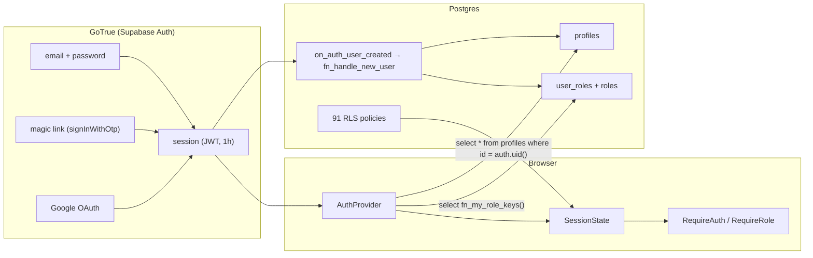
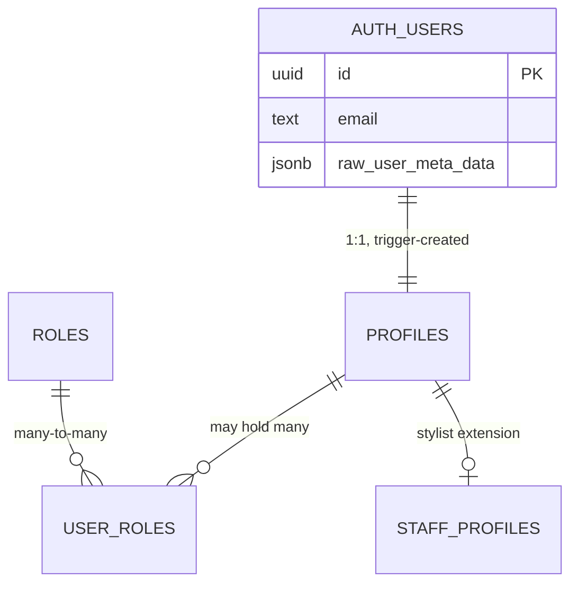

# 05 · Authentication model

Identity is Supabase GoTrue. Authorisation is Postgres. The browser holds neither a password nor a
role claim it can trust — it holds a JWT, and every decision downstream of that JWT is made by a
policy or a `SECURITY DEFINER` function.



---

## Signup

`AuthProvider.signUp` (`src/features/auth/AuthProvider.tsx`):

```ts
const { data, error } = await supabase.auth.signUp({
  email, password,
  options: {
    data: { full_name: fullName },
    emailRedirectTo: `${env.app.url}/auth/confirm`,
  },
})
```

`data.full_name` exists for one reason: the database trigger reads it. `options.data` becomes
`auth.users.raw_user_meta_data`, and `fn_handle_new_user` is the only consumer.

The phone number is set with a separate `auth.updateUser({ phone })` call, best-effort
(`.catch(() => undefined)`), because phone enrolment can require a different channel than email.
`supabase/config.toml` has `[auth.sms] enable_signup = false`, so that call is a no-op locally.

The return value is `{ needsEmailConfirmation: !data.session, email }`, and `SignUpPage` branches on
it. With `double_confirm_changes = true` and `enable_confirmations = false` locally, a local signup
returns a session immediately; a hosted project with confirmations on does not.

## `fn_handle_new_user` — profile provisioning

```sql
create trigger on_auth_user_created
  after insert on auth.users
  for each row execute function public.fn_handle_new_user();
```

The function is `security definer set search_path = public, pg_temp`, which is what lets it insert
into `profiles` and `user_roles` despite their RLS policies.

What it does:

1. Derives a display name: `coalesce(raw_user_meta_data->>'full_name', raw_user_meta_data->>'name',
   split_part(new.email, '@', 1))`.
2. Slugifies it and appends `left(uuid::text, 6)`. The suffix is not cosmetic: two people called
   "Ada Okafor" would otherwise collide on `profiles.slug`, which is `unique`. The slug is a display
   handle, so ugliness is an acceptable trade for guaranteed insertion.
3. Inserts the `profiles` row with `on conflict (id) do update`, and deliberately does **not** clobber
   an existing display name — only `email` is refreshed, and `full_name` uses
   `coalesce(nullif(profiles.full_name, ''), excluded.full_name)`.
4. Grants exactly one role:

```sql
insert into public.user_roles (user_id, role_id)
values (new.id, (select id from public.roles where key = 'customer'))
on conflict do nothing;
```

That `select … where key = 'customer'` will insert `null` if the role is missing, which the
`not null` constraint on `role_id` turns into a signup failure. The seed migration guarantees the row
exists. The failure mode is loud rather than silent, which is the right way round.

**The trigger cannot grant elevation.** There is no branch in it that reads a role from user
metadata, and even if there were, `insert into user_roles` as the table owner would still be
constrained by the trigger's own code. Elevation is always a separate, deliberate act — an admin
insert, or the bootstrap script.

## Sessions, storage and refresh

`src/lib/supabase/client.ts`:

```ts
auth: {
  persistSession: true,        // localStorage
  autoRefreshToken: true,      // the client refreshes before expiry
  detectSessionInUrl: true,    // PKCE / implicit hashes are consumed on load
  flowType: 'implicit',
}
```

`db.schema` is pinned to `public`, so PostgREST never searches another schema. A custom
`x-application-name: unisex-hair-studio` header rides on every request, which makes the function's
requests identifiable in the Supabase logs.

`getSupabase()` is a memoised singleton; `supabase` is a `Proxy` over it so modules can import a
value-like object without constructing the client at import time. `__setSupabase` exists purely as a
test seam.

### The `AuthProvider` lifecycle

```mermaid
sequenceDiagram
  participant M as main.tsx
  participant A as AuthProvider
  participant G as GoTrue
  participant Q as TanStack Query

  M->>A: mount
  A->>G: getSession()
  G-->>A: session | null
  A->>A: applyUser(user)
  A->>G: select * from profiles where id = uid
  A->>G: select fn_my_role_keys()
  A->>A: setState(SessionState)
  A->>G: onAuthStateChange(cb)
  Note over A,G: TOKEN_REFRESHED → return early (no cache clear,
  no re-hydrate). A refresh changes the token, not the identity;
  re-running the profile and role queries would double every
  request on a busy tab.
  Note over A: any other event (SIGNED_IN, SIGNED_OUT,
  USER_UPDATED, INITIAL_SESSION):
  A->>Q: resetQueryCache()  →  queryClient.clear()
  A->>A: applyUser(next user)
```

The cache clear is the important part. A shared `QueryClient` outlives any single identity, so
without `queryClient.clear()` on sign-out and on every sign-in, a second person using the same
browser could render the first person's cached appointments, orders and notifications — a real
leak that has nothing to do with RLS, because the data never leaves the browser. RLS protects the
network; the clear protects the cache.

`signOut` also calls `resetQueryCache()` explicitly and resets local state, so the path is covered
twice (once from the provider, once from the event).

### Token refresh

- JWT lifetime is 3600 s in `config.toml`; `autoRefreshToken` renews it in place and
  `onAuthStateChange` fires `TOKEN_REFRESHED`.
- The refreshed token replaces the stored session; nothing in the app re-renders on that event, by
  design.
- `enable_refresh_token_rotation = true` with `reuse_interval = 10` in the local config. On a
  hosted project the reuse interval is a security decision: setting it to 0 invalidates a token as
  soon as it is reused, which is stricter and the right default for a public site.
- `AuthProvider.refresh()` re-reads the session and re-hydrates on demand. It exists for the case
  where a role was granted mid-session and the user does not want to sign out.

## Password reset

Two steps, and the second one is currently an empty page.

1. `resetPassword(email)` calls `auth.resetPasswordForEmail(email, { redirectTo:
   `${env.app.url}/auth/reset-password` })`. GoTrue sends a link with a recovery token; the
   `detectSessionInUrl` client picks the token up out of the URL fragment on arrival.
2. `/auth/reset-password` should call `updatePassword(password)`
   (`auth.updateUser({ password })`) and then `signOut`, because the recovery session is a
   single-purpose session.

`ForgotPasswordPage.tsx` and `ResetPasswordPage.tsx` are both four-line placeholders. The provider
methods exist and are correct; the screens that call them do not. Treat this pair as
**not yet implemented** at the UI layer.

`AuthProvider.mapAuthMessage` translates GoTrue's technical strings into sentences a person can act
on — invalid credentials, unconfirmed email, already registered, minimum password length, rate
limiting, malformed email. Anything it does not recognise is passed through unchanged, so a new
GoTrue message is never swallowed.

## OAuth

`signInWithGoogle()` calls `auth.signInWithOAuth({ provider: 'google', redirectTo:
`${env.app.url}/auth/confirm` })`. Google is a convenience, not a requirement: a customer who
arrives from a shared link with no Google account still signs in with a password.

Configuration is per project. Locally it is deliberately off:

```toml
[auth.external.google]
enabled = false
client_id  = "env(SUPABASE_AUTH_GOOGLE_CLIENT_ID)"
secret     = "env(SUPABASE_AUTH_GOOGLE_SECRET)"
```

To enable it, set the client id and secret in the Supabase dashboard (Authentication → Providers →
Google), and add the callback URL `https://<project-ref>.supabase.co/auth/v1/callback` plus
`/auth/confirm` to the project's allowed redirect URLs. The redirect lands on `AuthConfirmPage`,
which is also currently a placeholder — the `session` handling itself works because
`detectSessionInUrl` runs in the client, but the confirmation screen does not yet tell the person
what happened.

## The profile and role model



`SessionState` (`src/types/index.ts`) is the only authorisation shape the UI consumes:

```ts
{ user, profile, roles: RoleKey[], isAuthenticated, isStaff, isAdmin, isLoading }
```

`isStaff` is `roles.includes('staff') || roles.includes('admin')`. `postSignInPath` routes by role:
`/admin`, `/staff`, or `/account`. `deriveSessionState` in `src/lib/api/account.ts` produces the
same object outside the provider, for tests.

The three hooks split the surface so a component that only needs identity does not re-render when
roles change: `useAuth()` (everything), `useUser()` (identity only), `useRoles()` (roles only).

### The four roles, as seeded

| `roles.key` | Rank | `capabilities` |
| --- | --- | --- |
| `customer` | 10 | `{}` |
| `staff` | 50 | `appointments.read_assigned`, `appointments.update_assigned`, `requirements.read_assigned`, `orders.fulfil`, `inventory.read`, `applications.review` |
| `supervisor` | 70 | the staff set plus `appointments.read_all`, `requirements.read_all`, `inventory.adjust`, `reviews.moderate` |
| `admin` | 100 | `*` |

The capability strings are documentation-grade rather than load-bearing: `app_private.has_capability`
exists and is granted to nobody, and no policy or function consults it. Row access is decided purely
by role *key* through `app_private.has_role`. See
[06 · Known gaps](./06-rls-and-permissions.md#known-gaps) for what that means for `supervisor`.

## Why roles are a table and not an enum

The obvious alternative is `profiles.role user_role not null default 'customer'`, with the enum
extended by a migration whenever a new role appears. The schema uses
`roles` + `user_roles` instead. Four reasons, in order of weight:

1. **A user can hold more than one role.** A part-time stylist who also reviews applications is a real
   case. An enum column forces the shape of "exactly one", and the usual workarounds (a second
   nullable column, a bitmask, a JSON blob) are all worse than a join table.
2. **Roles can carry data.** `capabilities text[]`, `rank smallint`, `is_system boolean`,
   `description`. An enum carries nothing except membership, so every capability check would have to
   be a hard-coded `case` in a plpgsql function — a migration each time.
3. **Grant metadata is required by the audit story.** `user_roles.granted_by` records who elevated
   whom, and `granted_at` records when. `profiles.role` has nowhere to put either. For a business
   where a compromised staff account is a real incident, "who made this an admin" is the first
   question asked.
4. **Time-bounded elevation needs a table.** `user_roles.expires_at` supports covering leave and
   temporary duty manager. `has_role` already honours it
   (`ur.expires_at is null or ur.expires_at > now()`); an enum column could not, short of a second
   table for exactly that job.

The cost is one join per policy evaluation. `has_role` is `STABLE SECURITY DEFINER` and the table is
small (one row per user, typically), so this is not a practical problem; `user_roles_role_idx` covers
the reverse direction.

The FK is `user_roles.user_id → profiles.id`, not `→ auth.users.id`, which keeps the entire
authorisation graph inside `public` and therefore inside the migration set. Deleting the auth user
cascades to `profiles` and on to `user_roles`.

## Why route guards are UX and not security

`src/components/layout/RouteGuards.tsx` says this in its own header comment: *"These exist to give
a good experience and keep clients out of screens they cannot use — they are not a security
boundary. Every protected query is already constrained by RLS, so bypassing a guard reveals layout,
never data."*

The three guards:

| Guard | Behaviour | What it is not |
| --- | --- | --- |
| `RequireAuth` | spinner while loading; `<Navigate to="/auth/sign-in" state={{ from: location }} replace />` when there is no session; otherwise children | It does not stop a signed-in user from rendering the page. It says nothing about whether the queries succeed. |
| `RequireRole` | same, plus a role check and a role-aware fallback (`/admin` → `/staff` → `/account`) | Roles come from the cached `fn_my_role_keys()` result. A stale or forged client state changes the UI and nothing else. |
| `RequireAccount` | sends anonymous visitors to sign-up with a return target | Prompts; does not block. |

Concretely, the bypass cases and what actually happens:

- **Edit the URL to `/admin`.** `RequireRole` redirects. Ignore it (disable React, call the
  component) and the dashboard queries run — and return nothing, because
  `appointments_select_participants` and friends evaluate `fn_is_admin()` server-side against the
  verified JWT. The screen renders with empty states.
- **Reuse another customer's `orderId` in `/account/orders/{id}`.** `orders_select_participants`
  filters on `customer_id = auth.uid()`. Zero rows.
- **Call `fn_adjust_stock` with an admin-looking argument.** The function checks
  `app_private.is_staff_or_admin(auth.uid())` and raises `insufficient_privilege`. The argument
  cannot help: no function accepts a caller-supplied user id for a privilege decision.

There is exactly one thing a guard genuinely protects, and it is real: a signed-in customer never
downloads the admin chunk. `RequireRole` sits outside the lazy import, so `React.lazy` for
`AdminDashboardPage` is never evaluated for them. That is a payload optimisation, not a
confidentiality control — the code is public, the data is not.

## Column guards against privilege escalation

The escalation paths a schema invites, and how each is closed.

| Attempt | What stops it | Where |
| --- | --- | --- |
| Promote yourself by `update profiles set … ` | There is no role column on `profiles`. Roles are rows in `user_roles`, and `user_roles_admin_manage` requires `fn_is_admin()`. | migration 0012 |
| Insert a `user_roles` row directly | `user_roles_admin_manage` is `for all … using (fn_is_admin()) with check (fn_is_admin())`. Both the read and the write side are checked. | 0012 |
| Put `admin` in signup metadata | The trigger grants exactly one hard-coded role. | 0008 |
| Unsuspend yourself | `guard_profile_columns` raises on any change to `id`, `email` or `status` for a non-admin, and `profiles_update_self` still allows the row. | 0014 |
| Change your own email | Same trigger: `email` is owned by `auth.users`, and the `profiles.email` copy is informational. | 0014 |
| Edit an appointment's price as staff | `appointments_staff_update` allows the update, then `guard_appointment_columns` raises on `subtotal`, `discount`, `total`, `deposit_amount`, `deposit_paid`, `payment_status`, `customer_id`, `service_id`, `location_id`. | 0014 |
| Move your own appointment to another stylist | The guard permits a slot change only when `new.staff_id = auth.uid()`; anything else raises. A stylist cannot hand a booking to a colleague. | 0014 |
| Edit order totals as fulfilment staff | `guard_order_columns` raises on every money and customer column. | 0014 |
| Change a price or a stock level as staff | `guard_variant_columns` raises on `price`, `cost_price` and `stock_on_hand` for a non-admin. | 0014 |
| Forge a role by calling a helper | `fn_is_admin`, `fn_is_staff`, `fn_is_staff_or_admin` and `fn_is_assigned_staff` are all revoked from `anon` and `authenticated`. Policies call the `app_private` originals. | 0012 |
| Replay a `p_force` argument | `fn_create_appointment` derives the privilege: `if p_force and not app_private.is_staff_or_admin(auth.uid()) then raise`. | 0009 |
| Read another customer's requirements | `requirements_select_participants` requires `customer_id = auth.uid()` or assignment through the appointment. | 0012 |
| Read a private reference image | The `requirements` bucket is `public = false`; the read policy requires folder ownership, assignment through `requirement_media`, or admin. | 0014 |

The general pattern: **row-level rules answer "which rows", column guards answer "which columns",
and the function body answers "is this transition legal at all".** All three are needed. Any one of
them alone is bypassable.

## Authentication gaps

| Gap | State |
| --- | --- |
| `SignUpPage` | Placeholder. The provider method and the trigger are complete; the screen is not. |
| `ForgotPasswordPage`, `ResetPasswordPage` | Placeholders. `resetPassword` / `updatePassword` exist unused. |
| `AuthConfirmPage` | Placeholder. The recovery and OAuth flows land on an empty page. |
| Phone OTP sign-in | Not exposed. `signInWithOtp` is email-only; `[auth.sms] enable_signup = false`. |
| MFA / TOTP | Not configured. Worth enabling on a project that grants `admin` to real people. |
| Role changes mid-session | Require a re-hydrate (`AuthProvider.refresh()`) or a sign-in. There is no realtime subscription on `user_roles`. |
| `supervisor` | Seeded with extra capabilities but not honoured by `app_private.is_staff()`. See [06](./06-rls-and-permissions.md#known-gaps). |
