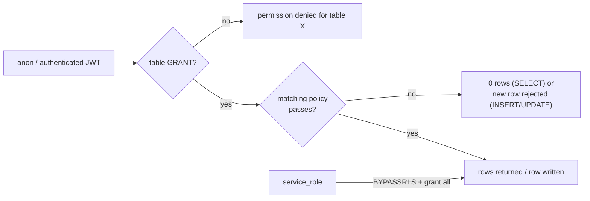

# 06 · RLS and permissions

Migration 0012 states the four principles it implements:

1. Deny by default — RLS is enabled on every table, no policy means no rows.
2. Money and state transitions go through `SECURITY DEFINER` functions that re-authorise; direct
   writes to `appointments` / `orders` are not granted.
3. `security definer` helpers never accept a caller-supplied user id for privilege decisions; they
   read `auth.uid()` or take a business key.
4. Public catalogue reads go through narrow views so sensitive columns never reach the client.

This document expands each one and gives the full matrix. The real numbers: **91 policies in
`public`** (all in migration 0012) plus **7 policies on `storage.objects`** in migration 0014;
**45 of the 47 tables** have at least one policy.

---

## Two independent gates

A statement must satisfy both a `GRANT` and a policy. Most of the design decisions only make sense
once you hold both in mind.



Worked example — the inventory ledger. `inventory_admin_manage` is written
`for all to authenticated using (fn_is_admin())`, which looks like administrators can insert and
delete. They cannot: the only grant on `inventory_movements` is `select`. Policy and grant are
separate, and the narrower one wins. That is why the ledger is append-only without needing a trigger
to prevent edits.

The reverse case: `wishlist_items` has a full CRUD grant *and* a `for all` policy scoped to
`user_id = auth.uid()`. `commerce.ts:toggleWishlist` uses that to insert and delete directly. Both
sets of permissions are deliberately present.

---

## The `app_private` schema

Created in migration 0001 and revoked in the same statement:

```sql
create schema if not exists app_private;
revoke all on schema app_private from public, anon, authenticated;

comment on schema app_private is
  'Server-only helpers. No client exposure. Reserved for Edge Functions and cron.';
```

Eighteen functions live there: the role helpers, the `updated_at` trigger, the four column guards,
the four audit triggers, the job-queue claim/complete pair, hold purging and `housekeeping`. Every
one is `security definer` with `set search_path = public, pg_temp` — a locked search path is what
stops a caller from shadowing a function or operator with a temporary object of the same name.
Migration 0012 revokes execute on all eighteen from `public, anon, authenticated` as a second,
redundant line of defence.

The reason they must be `security definer` is structural, not stylistic. `has_role` reads
`user_roles`, and the policy on `user_roles` calls `has_role`. If the helper ran as the invoking
role, evaluating a policy on `user_roles` would require reading `user_roles`, which would evaluate
that same policy again. Running as the table owner breaks the cycle — and the authorise-inside-the-
function discipline below is what keeps that from being a privilege escalation.

## The helpers

```sql
app_private.has_role(p_user_id uuid, p_keys text[]) → boolean
app_private.has_capability(p_user_id uuid, p_cap text) → boolean
app_private.is_admin(p_user_id uuid) → boolean         -- has_role(uid, ['admin'])
app_private.is_staff(p_user_id uuid) → boolean         -- has_role(uid, ['staff','admin'])
app_private.is_staff_or_admin(p_user_id uuid) → boolean -- identical to is_staff
```

Each is `stable security definer set search_path = public, pg_temp`, and each honours
`user_roles.expires_at`:

```sql
and (ur.expires_at is null or ur.expires_at > now())
```

`public` wraps them for session-scoped use — `fn_is_admin()`, `fn_is_staff()`,
`fn_is_staff_or_admin()`, `fn_my_role_keys()`, `fn_is_assigned_staff(uuid)` — and all of those are
**revoked from `anon` and `authenticated`**. They exist to be called *inside policies*, where
`auth.uid()` is meaningful, not from the network. `fn_my_role_keys()` is the single exception: it is
granted to `anon, authenticated` because the client needs to know its own roles to render navigation.

`fn_is_assigned_staff(uuid)` is defined, revoked, and referenced by nothing. It was intended for
policies that need "is this stylist mine", which the current policies express inline instead.

## Why `FORCE ROW LEVEL SECURITY` is deliberately not used

Migration 0012 issues `alter table public.<t> enable row level security` for all 47 tables and never
issues `force row level security`. That is a decision, not an omission.

`ENABLE ROW LEVEL SECURITY` makes policies apply to every role **except** roles with `BYPASSRLS` and
the table owner. In Supabase that means `service_role` (created `bypassrls` by the platform, and
granted `all on all tables in schema public` at the end of migration 0012) and `postgres` — the role
that owns the tables and is therefore the owner.

`FORCE ROW LEVEL SECURITY` extends policies to the owner as well. Turning it on would break the
system in three specific ways:

1. **Every `SECURITY DEFINER` function would be evaluated against its own policies.** They run as the
   owner. `fn_admin_dashboard_stats` is `security definer`; with RLS forced on `appointments`, its
   `select count(*)` would be filtered to `customer_id = auth.uid()`, and a stylist calling it would
   see a dashboard scoped to their own bookings rather than the salon's. The function would still
   work — and would be silently wrong.
2. **Recursion.** The role helpers read `user_roles` while the `user_roles` policy calls the role
   helpers. With RLS forced, the inner read re-enters the policy, which calls the helper again. The
   planner caches the function within a statement, so this is survivable in practice, but it is a
   fragility the design should not carry.
3. **Migrations and maintenance would stop working.** The seed inserts into `roles`, `services`,
   `location_hours` and the rest through the owner. With RLS forced there is no `INSERT` policy for
   `anon` or `authenticated` on most of those tables, so `supabase db reset` and any SQL-editor
   maintenance session would fail.

The trade being made: the owner role is fully trusted, and the design keeps the owner's power
*inside* 42 reviewed, auditable `SECURITY DEFINER` functions rather than granting it to anyone by
default. The corollary is that `service_role` and SQL-editor access are secrets of the same
importance as the Paystack secret key. If the project ever needs defence in depth against a
compromised service-role key, the right move is a dedicated non-owner role for the Edge Functions
plus forced RLS — a larger change than it looks.

## Public catalogue views

```sql
create or replace view public.staff_public
with (security_invoker = false) as ...
```

All three are created with `security_invoker = false`, so the view's own `where` clauses decide what a
row is, regardless of the caller's own row-level context. That is what makes them safe to grant to
`anon`.

| View | Grain | Filter | Columns deliberately absent |
| --- | --- | --- | --- |
| `staff_public` | one row per bookable stylist | `profiles.status = 'active' and staff_profiles.is_bookable` | `commission_pct`, `hourly_rate`, `hired_on`, `employment_end_on` |
| `service_catalog` | one row per (service, active variant) | `services.status = 'active'`, `service_variants.is_active` | `buffer_minutes`, `cleanup_minutes`, `max_concurrent`, `display_order`, `is_popular` (not exposed separately), meta fields |
| `product_catalog` | one row per (product, active variant with stock) | `products.status = 'active'`, `v.is_active and v.stock_on_hand > 0` | `cost_price`, `tax_rate`, `safety_stock`, `weight_g`, `video_url` |

`product_catalog` also computes the available quantity inline, so the client never has to know the
`on_hand − reserved − safety_stock` rule:

```sql
greatest(v.stock_on_hand - v.stock_reserved - v.safety_stock, 0) as available_stock
```

`service_catalog` and `product_catalog` fan out one row per variant, which is why
`src/lib/api/catalog.ts:dedupeServices` and `commerce.ts:collapseVariants` exist: the view is the
right grain for a detail page and the wrong grain for a grid, and the client collapses it.

`fn_available_stock(variant)` is the RPC equivalent, for the cart.

## Column guards

RLS decides which rows. The four `before update` triggers in `app_private` decide which columns, and
each returns early for an admin:

| Guard | Table | Immutable for non-admins |
| --- | --- | --- |
| `guard_profile_columns` | `profiles` | `id`, `email`, `status` |
| `guard_appointment_columns` | `appointments` | `customer_id`, `service_id`, `location_id`, `subtotal`, `discount`, `total`, `deposit_amount`, `deposit_paid`, `payment_status`; plus `starts_at` / `ends_at` / `staff_id` unless the new `staff_id = auth.uid()` **and** the caller is staff |
| `guard_order_columns` | `orders` | `customer_id`, `subtotal`, `discount_total`, `shipping_total`, `tax_total`, `total`, `paid_total`, `refund_total`, `payment_status`, `currency` |
| `guard_variant_columns` | `product_variants` | `price`, `cost_price`, `stock_on_hand` (for non-admins) |

Each raises `insufficient_privilege` (42501), so the client can tell "not allowed" from "not valid"
and does not retry. Full detail in [02 · Column-guard triggers](./02-database-schema.md#column-guard-triggers).

Note the asymmetry in `guard_variant_columns`: it blocks *everyone* who is not an admin from changing
`stock_on_hand`, including staff — stock moves only through `fn_adjust_stock`, which writes a ledger
row. That is the mechanism that keeps the ledger complete.

---

## The permission matrix

Two gates per cell, as described above. `S` = staff, `V` = supervisor, `A` = admin, `C` = customer,
`anon` = no session.

**`V` is identical to `S` in every row.** `app_private.is_staff()` and `is_staff_or_admin()` test
`['staff','admin']` and do not include `'supervisor'`, even though the `supervisor` role is seeded with
`appointments.read_all`, `requirements.read_all`, `inventory.adjust` and `reviews.moderate`. A
supervisor is therefore admitted to `/staff` by `RequireRole` and then finds the diary empty. This is
the single largest inconsistency in the permission model; see
[Known gaps](#known-gaps).

### Identity and tenancy

| Table | anon | C | S | V | A | Mechanism |
| --- | --- | --- | --- | --- | --- | --- |
| `profiles` | — | R own, U own | R all | R all | R/U/D all | `profiles_select_self_or_staff`, `profiles_update_self`, `profiles_admin_delete`; `guard_profile_columns` on U |
| `roles` | R all | R all | R all | R all | R all | `roles_select using (true)` |
| `user_roles` | — | R own | R own | R own | R/W/D all | `user_roles_select_own`, `user_roles_admin_manage` |
| `staff_profiles` | via `staff_public` | R own | R own + R all | R own + R all | R/U/D all | `staff_profiles_select_authenticated`, `staff_profiles_update_self`, `staff_profiles_admin_manage`. No column guard. |
| `salon_locations` | R active | R active | R active | R active | R/U/D all | `locations_public_read`, `locations_admin_write` |
| `business_settings` | R | R | R | R | R/U/D all | `settings_public_read`, `settings_admin_write` |
| `audit_log` | — | — | — | — | R | `audit_log_admin_read`. No write grant at all. |

### Content and catalogue

| Table | anon | C | S | V | A | Mechanism |
| --- | --- | --- | --- | --- | --- | --- |
| `service_categories` | R active | R active | R all | R all | R/U/D all | `service_categories_public_read`, `service_categories_admin_write` |
| `services` | R active | R active | R all | R all | R/U/D all | `services_public_read`, `services_admin_write` |
| `service_variants` | R active | R active | R all | R all | R/U/D all | `service_variants_public_read`, `service_variants_admin_write` |
| `staff_services` | R active | R active | R all | R all | R/U/D all | `staff_services_public_read`, `staff_services_admin_write` |
| `gallery_items` | R published | R published | R all | R all | R/U/D all | `gallery_public_read`, `gallery_admin_write` |
| `faqs` | R published | R published | R all | R all | R/U/D all | `faqs_public_read`, `faqs_admin_write` |
| `pages` | R published | R published | R all | R all | R/U/D all | `pages_public_read`, `pages_admin_write` |
| `reviews` | R published | R published + R own; I own; U own while `status='pending'` | R all; U all | R all; U all | R/U/D all | `reviews_public_read`, `reviews_insert_own`, `reviews_update_own_pending`, `reviews_admin_moderate` |
| `message_templates` | — | — | — | — | R/U/D all | `templates_admin_only` |

`reviews_insert_own` carries a real business rule in its `with check`: if `appointment_id` is set, a
matching appointment must exist with `customer_id = auth.uid()` **and** `status = 'completed'`. You
cannot review a service you have not received.

### Booking and availability

| Table | anon | C | S | V | A | Mechanism |
| --- | --- | --- | --- | --- | --- | --- |
| `location_hours` | R | R | R | R | R/U/D all | `location_hours_public_read`, `location_hours_admin_write` |
| `staff_availability_rules` | — | — | R own | R own | R all + U/D all | `availability_rules_staff_read`, `availability_rules_admin_write` |
| `staff_time_off` | — | R/W own | R/W own | R/W own | R/W/D all | `time_off_own_and_admin` |
| `blackout_dates` | — | — | — | — | R/U/D all | `blackout_admin_manage` |
| `appointments` | — | R own | R assigned | R assigned | R all; U all; D (policy only, **no grant**) | `appointments_select_participants`, `appointments_staff_update`, `appointments_staff_delete`; `guard_appointment_columns` |
| `appointment_status_history` | — | R own | R all; I all | R all; I all | R all; I all | `appointment_history_select_participants`, `appointment_history_staff_insert` |
| `booking_holds` | — | R own (no grant) | R all (no grant) | R all | R/U/D all (no grant) | `booking_holds_select_own`, `booking_holds_admin_manage`. Reachable in practice only through `fn_hold_slot`. |
| `requirements` | — | R own; I own; U own | R own + R assigned; U assigned | same as S | R/U/D all | `requirements_select_participants`, `requirements_insert_own`, `requirements_update_own_draft`, `requirements_staff_review` |
| `requirement_media` | — | R own; I own; D own | R assigned; I own or assigned; D own | same as S | R all; I all; D all | `requirement_media_select_participants`, `requirement_media_insert_own`, `requirement_media_delete_own` |

The five legal transitions are **not** available as row updates for a customer at all: there is no
`INSERT` grant and the only `UPDATE` policy is scoped to staff or admin. A customer cancels by
calling `fn_cancel_appointment`, which is authorised by ownership. See
[03 · Rescheduling and cancelling](./03-user-flows.md#4-rescheduling-and-cancelling).

### Commerce

| Table | anon | C | S | V | A | Mechanism |
| --- | --- | --- | --- | --- | --- | --- |
| `product_categories` | R active | R active | R all | R all | R/U/D all | `product_categories_public_read`, `product_categories_admin_write` |
| `products` | R active | R active | R all | R all | R/U/D all | `products_public_read`, `products_admin_write` |
| `product_variants` | R active + active parent | same | R all; U all | R all; U all | R/U/D all | `variants_public_read`, `variants_staff_update`, `variants_admin_write`; `guard_variant_columns` |
| `inventory_movements` | — | — | R | R | R (writes: **no grant**) | `inventory_staff_read`, `inventory_admin_manage` |
| `wishlist_items` | — | R/W/D own | R/W/D own | R/W/D own | R/W/D own | `wishlist_own` |
| `carts` | — | R own | R own | R own | R/U/D all | `carts_select_own`, `carts_admin_all` |
| `cart_items` | — | R via own cart | R via own cart | R via own cart | R/U/D all | `cart_items_via_cart`, `cart_items_admin_write` |
| `coupons` | R active | R active | R active | R active | R/U/D all | `coupons_public_read`, `coupons_admin_write` |
| `orders` | — | R own | R all; U all | R all; U all | R all; U all; I/D all | `orders_select_participants`, `orders_staff_update`; `guard_order_columns` |
| `order_items` | — | R via own order | R all | R all | R/U/D all | `order_items_select_participants`, `order_items_admin_manage` |
| `payments` | — | R own | R all; I all | R all; I all | R all; I all; U all | `payments_select_participants`, `payments_staff_insert`, `payments_admin_update`. Migration 0017 adds `revoke insert on public.payments from anon, authenticated`. |
| `payment_events` | — | — | — | — | — | **No policy, no grant.** `service_role` only. |

`variants_public_read` deserves a note because of its operator precedence:

```sql
using ( is_active
       and exists (select 1 from public.products p where p.id = product_id and p.status = 'active')
       or public.fn_is_staff_or_admin() )
```

`and` binds tighter than `or`, so this reads `(is_active and parent_active) or is_staff_or_admin()` —
staff bypass the filter entirely, which is the intent, but it is worth knowing before editing.

### Recruitment

| Table | anon | C | S | V | A | Mechanism |
| --- | --- | --- | --- | --- | --- | --- |
| `jobs` | R open | R open | R all | R all | R/U/D all | `jobs_public_read`, `jobs_admin_write` |
| `job_applications` | — | R own (by `applicant_id` **or** profile email) | R all; U all | R all; U all | R all; U all; I via RPC | `applications_select_own_or_staff`, `applications_staff_update` |
| `application_events` | — | — | R (no grant); I | R (no grant); I | R (no grant); I | `application_events_staff_read`, `application_events_staff_insert`. No table grant exists, so neither is reachable from the client today. |
| `job_alerts` | — | R/W/D own | R/W/D own | R/W/D own | R/W/D own | `job_alerts_own` |

Insertion is impossible directly — there is no `INSERT` grant on `job_applications`. Everything goes
through `fn_submit_application`, which is where the vacancy-is-open check, the consent check and the
anonymous rate limit live.

### Notifications and system

| Table | anon | C | S | V | A | Mechanism |
| --- | --- | --- | --- | --- | --- | --- |
| `notifications` | — | R/U/D own | R/U/D own | R/U/D own | R own only | `notifications_select_own`, `notifications_update_own`, `notifications_delete_own` |
| `notification_deliveries` | — | R own | R all | R all | R all | `deliveries_select_own_or_staff`. No write grant. |
| `notification_preferences` | — | R/W/D own | R/W/D own | R/W/D own | R/W/D own | `prefs_own` |
| `contact_points` | — | R/W/D own | R/W/D own | R/W/D own | R/W/D own | `contact_points_own` |
| `scheduled_jobs` | — | — | — | — | — | **No policy, no grant.** |
| `whatsapp_messages` | — | R own (no grant) | R all (no grant); I | same | R all; I | `whatsapp_select_participants`, `whatsapp_staff_insert`. No table grant. |

An administrator reading someone else's inbox is a deliberate non-case: `notifications_select_own`
is scoped to `recipient_id = auth.uid()` and there is no admin override. Support staff read
`notification_deliveries` for troubleshooting, not the customer's message body.

### RPC surface by role

| Caller | May execute |
| --- | --- |
| `anon` | `fn_service_slots`, `fn_is_slot_available`, `fn_cart_totals`, `fn_coupon_preview`, `fn_available_stock`, `fn_get_or_create_cart`, `fn_get_cart`, `fn_apply_cart_coupon`, `fn_my_role_keys`, `fn_naira`, `fn_slugify`, `fn_next_reference` |
| `authenticated` | everything above, plus `fn_hold_slot`, `fn_create_appointment`, `fn_cancel_appointment`, `fn_reschedule_appointment`, `fn_set_appointment_status`, `fn_add_to_cart`, `fn_update_cart_item`, `fn_remove_cart_item`, `fn_merge_carts`, `fn_checkout`, `fn_submit_application`, `fn_withdraw_application`, `fn_notify`, `fn_adjust_stock`, `fn_record_offline_payment`, `fn_set_order_status`, `fn_set_application_status`, `fn_admin_dashboard_stats` |
| nobody (revoked) | `fn_is_admin`, `fn_is_staff`, `fn_is_staff_or_admin`, `fn_is_assigned_staff`, `fn_handle_new_user`, `fn_notify_admins`, `fn_appointment_created`, `fn_order_created`, `fn_application_submitted`, `fn_recalculate_*`, and all 20 `app_private` functions |

Executing an RPC is not the same as being permitted its effect: `fn_adjust_stock`,
`fn_record_offline_payment`, `fn_set_order_status`, `fn_set_application_status` and
`fn_admin_dashboard_stats` are executable by any authenticated user and immediately raise
`insufficient_privilege` unless the caller is staff or admin.

`service_role` is granted a named subset of execute and table privileges in migration 0017, because
bypassing RLS does not bypass privileges.

---

## Anti-patterns the schema avoids

**No policy trusts a client-supplied identity.** Every policy uses `auth.uid()` or a `SECURITY
DEFINER` helper that reads `auth.uid()`. There is no `using (user_id = p_would_be_user_id)` shape
anywhere, so "acting as" is not expressible.

**No `SECURITY DEFINER` function takes a user id for an authorisation decision.** `p_customer_id` on
`fn_create_appointment` defaults to `auth.uid()` and is only honoured for staff — and the comment in
the function says so: *"A caller can set the argument, but never the privilege: derive it, never
trust it."* `fn_withdraw_application` takes only an application id and resolves ownership internally.

**No unlocked `search_path` on a definer function.** Every one of the 60 functions sets
`set search_path = public, pg_temp`. `app_private.touch_updated_at` is the only exception, and it
references no table.

**No table without RLS.** The validator asserts this, and it would fail the build otherwise.

**No unguarded table for sensitive data.** `payment_events`, `scheduled_jobs` and `whatsapp_messages`
have no policy at all; `audit_log` has a read-only admin policy and no write grant.

**No trigger that hides a state transition.** `log_appointment_status`, `log_order_created`,
`sync_review_rollups` and `log_application_status` are `after` triggers, so no caller can skip them
by writing a row directly.

**No derived value that can be set by hand.** `appointments.balance_due` is
`generated always as … stored`; ratings are recomputed by trigger from published reviews;
`appointments.reference` and `orders.order_number` are generated by `fn_next_reference`.

**No money column a client can write.** Column guards cover `profiles`, `appointments`, `orders` and
`product_variants`. The two tables with money and no guard are `payments` and
`order_items.cost_snapshot`; see below.

**No denormalised copy that can disagree with its source.** `order_items` and `cart_items` hold
price snapshots deliberately, and both are re-derived from the live row at the moment they matter:
`fn_update_cart_item` re-reads `product_variants.price`, and `fn_checkout` writes
`unit_price = v_variant.price` rather than copying the cart line.

**No unbounded growth in the booking path.** `booking_holds` is the only table written per slot
interaction; `app_private.purge_expired_holds()` and `app_private.housekeeping()` bound it, along with
finished `scheduled_jobs` and expired notifications.

**No reliance on the anon key being secret.** Nothing sensitive is reachable with it — with one
exception, below.

---

## Known gaps

Five findings. Each is a statement of what the schema permits today, not a recommendation list.

### 1. `supervisor` is seeded but not enforced

`app_private.is_staff()` and `is_staff_or_admin()` test `array['staff','admin']`. `supervisor` is not
in either list, and `app_private.has_capability()` — which would be the natural way to express
"read all appointments" — is not called by any policy or function.

Consequence: a user holding only the `supervisor` role passes
`RequireRole(['staff','supervisor','admin'])`, downloads the staff chunks, and then reads empty
lists, because `appointments_select_participants` resolves `fn_is_staff()` to false. The
`supervisor` capability strings are currently documentation. The one-line fix is to include
`'supervisor'` in the membership array, or to route the two "read all" behaviours through
`has_capability`.

### 2. `fn_merge_carts` accepts a caller-supplied `p_user_id`

```sql
create or replace function public.fn_merge_carts(p_session_token text, p_user_id uuid) returns void
```

The function is `security definer` and granted to `authenticated`, and it writes
`insert into public.carts (user_id) values (p_user_id)` with no check that
`p_user_id = auth.uid()`. A signed-in caller who knows another visitor's guest session token can
insert lines into that visitor's account cart, capped at `stock_on_hand`, and delete the guest cart.
It cannot read either cart afterwards (`carts_select_own` is scoped to `auth.uid()`), and it is the
only definer function in the codebase that takes a user id — it is the exception to the rule stated
in principle 3 of migration 0012. `fn_get_or_create_cart` calls it correctly, with the session's own
uid. Compare `fn_withdraw_application`, which resolves ownership internally.

### 3. Review moderation can be bypassed by the author

`reviews_insert_own` constrains `customer_id` and, when `appointment_id` is present, that the
appointment is the caller's and completed. It does not constrain `status`. `reviews_update_own_pending`
allows an update while the row is `pending`, and its `with check` only re-verifies
`customer_id = auth.uid()` — not that `status` is still `pending`.

So a customer can insert `status = 'published'`, or flip a `pending` review to `published` with a
single `update`. Anonymous visitors would then see it (`reviews_public_read`), and it would feed the
rating rollups (`fn_recalculate_*` counts `status = 'published'`). The client
(`src/lib/api/account.ts:submitReview`) always sends `status: 'pending'`, so this requires a
hand-crafted request. A `with check (customer_id = auth.uid() and status = 'pending')` on the update
policy, plus forcing `pending` on insert, closes it.

### 4. `cost_price` and `tax_rate` are readable by `anon`

The `product_catalog` view deliberately omits them, and the comment on the view says so. But
migration 0012 also grants:

```sql
grant select on public.services, …, public.products, public.product_variants, … to anon, authenticated;
```

with `products_public_read using (status = 'active')` and `variants_public_read` likewise. A client
can therefore issue `select cost_price, tax_rate from products` as `anon` and receive wholesale cost
data for every active product, and `product_variants.cost_price` per SKU. The same is not true of
`staff_profiles.commission_pct` or `hourly_rate` — those tables have no anon grant, which is why the
`staff_public` view is sufficient. The fix is to drop `products` and `product_variants` from the anon
grant list and let `product_catalog` be the only anonymous product surface, which is what principle 4
of migration 0012 intends.

### 5. Two smaller ones

- `staff_profiles` has a full `update` grant plus `staff_profiles_update_self`, and no column guard.
  A stylist can write their own `commission_pct`, `hourly_rate` and `is_bookable`. Nothing currently
  reads those columns in a money path, so the impact is data integrity rather than loss, but a
  `guard_staff_profile_columns` mirror of the other three would be consistent.
- `payments` has an admin `UPDATE` policy and an `update` grant, and no column guard, so an
  administrator can amend a recorded payment (`amount`, `refunded_amount`, `status`) directly. It
  cannot move the order's money, because `guard_order_columns` blocks `orders.paid_total` and
  `payment_status`; but the payment record itself is not append-only the way
  `inventory_movements` is. Migration 0017 closes the fabrication half of this by revoking the
  client `insert` on `payments` — the webhook, `fn_record_offline_payment` and the initialize
  function are now the only writers — but the admin `update` remains.

`fn_merge_carts` deserves a second look regardless of exploitability, because it is the one function
whose signature advertises the flaw. Either drop the parameter and use `auth.uid()`, as
`fn_get_or_create_cart` does, or make it `app_private` and call it from `fn_get_or_create_cart`
directly.
