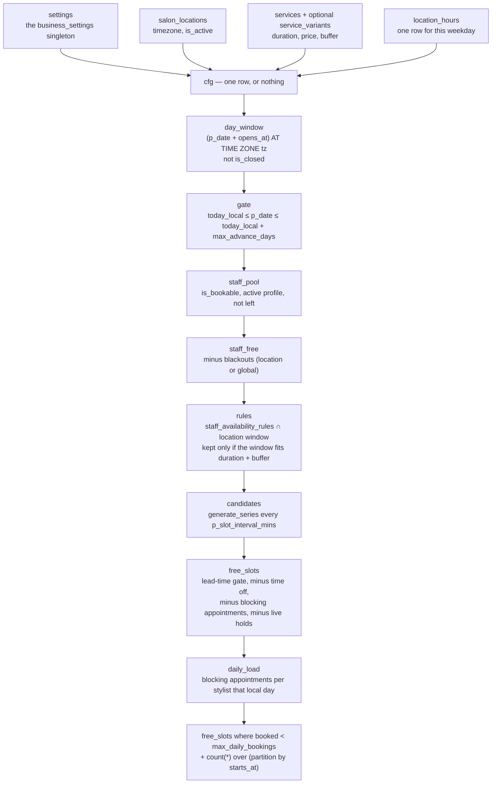
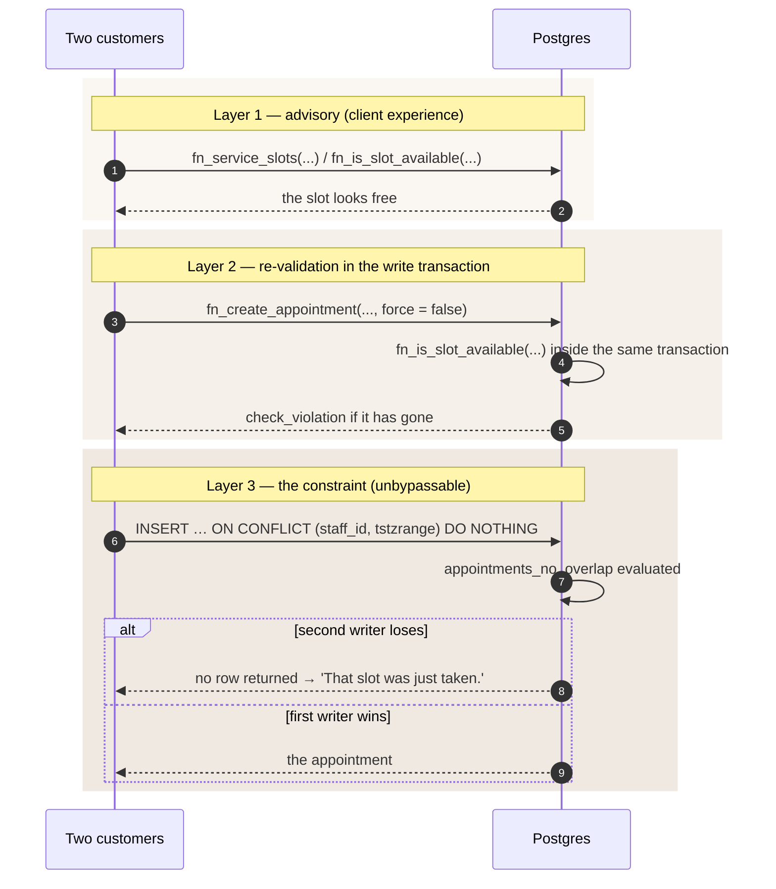
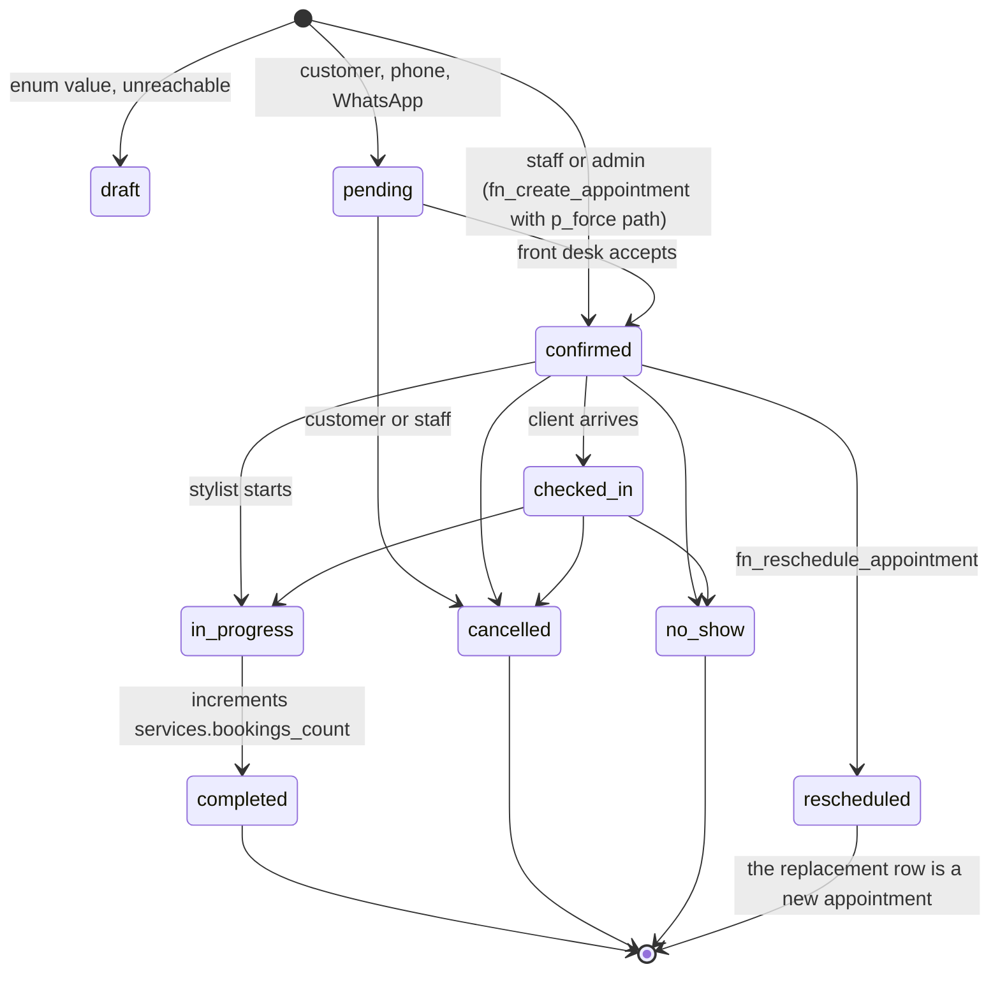

# 07 · Availability and booking engine

`fn_service_slots` is the function most worth understanding in this codebase: it turns seven tables
and the singleton settings row into "when can this stylist take this service, for how long, at what
price". It is also, deliberately, not the thing that prevents double-booking.

Migration 0009 states the design in its header: *the client calls `fn_service_slots()` to render a
calendar. That call is advisory. The authoritative guards are (a) `fn_create_appointment()`, which
re-validates inside a transaction, and (b) the `appointments_no_overlap` exclusion constraint, which
cannot be bypassed by any code path.*

---

## `fn_service_slots`, layer by layer

```
fn_service_slots(
  p_location_id        uuid,
  p_service_id         uuid,
  p_date               date,
  p_staff_id           uuid        default null,   -- filter to one stylist
  p_service_variant_id uuid        default null,   -- variant overrides price + duration
  p_slot_interval_mins integer     default 15
) returns table (
  starts_at, ends_at, staff_id, staff_name, staff_title, staff_photo_url,
  price numeric, staff_count bigint
)
```

`stable`, `security definer`, granted to `anon, authenticated`, executed by PGlite in the validator.
One row per `(start_time, stylist)`; `staff_count` is a window function over the same start time, so
the client can render "3 stylists free at 14:00" from a single call.



### 1. `cfg` — resolve configuration, or produce nothing

```sql
from public.salon_locations l
join public.services s on s.id = p_service_id and s.status = 'active'
left join public.service_variants sv
       on p_service_variant_id is not null
      and sv.id = p_service_variant_id and sv.service_id = s.id and sv.is_active
join public.location_hours h
       on h.location_id = p_location_id
   and h.weekday = extract(dow from p_date)::smallint
cross join settings st
where l.id = p_location_id and l.is_active
```

Every join is an inner join except the variant, so an unknown service, an inactive location, a closed
day or a missing `location_hours` row for that weekday all collapse to **zero rows** rather than an
error. That is the right failure mode for a calendar: show nothing rather than show a wrong slot.

The variant is deliberately guarded on `sv.service_id = s.id`, so a caller cannot price a shoulder-length
braid with the duration of a balayage from a different service.

Resolved values:

| Alias | Source |
| --- | --- |
| `tz` | `salon_locations.timezone` (`Africa/Lagos` in the seed) |
| `duration` | `coalesce(sv.duration_minutes, s.duration_minutes)` |
| `price` | `coalesce(sv.price, s.price_from)` |
| `buffer_mins` | `coalesce(s.buffer_minutes, 0)` |
| `global_buffer` | `business_settings.buffer_between_bookings` |
| `lead_hours` | `business_settings.booking_lead_time_hours` |
| `lead_hours_total` | `booking_lead_time_hours + min_notice_hours` |
| `max_advance_days` | `business_settings.max_advance_days` |

### 2. `day_window` — local clock to UTC instants

```sql
(p_date + cfg.opens_at) at time zone cfg.tz as open_at,
(p_date + cfg.closes_at) at time zone cfg.tz as close_at
...
where not cfg.is_closed
```

`p_date + opens_at` is a `date + time` → `timestamp without time zone` interpreted as **local wall
time in the location's timezone**; `at time zone 'Africa/Lagos'` converts that wall time to a
`timestamptz`. `tstzrange(starts_at, ends_at)` comparisons in stage 8 are therefore in absolute
instants, not wall time. Everything downstream — the exclusion constraint, `now()`, the daily-load
date bucket — agrees on that.

Two consequences worth knowing: the database session's `TimeZone` setting is irrelevant (the
conversion is explicit on both sides), and the design would remain correct across a DST transition
even though `Africa/Lagos` does not observe one.

### 3. `gate` — the booking horizon

```sql
where p_date >= (now() at time zone dw.tz)::date
  and p_date <= (now() at time zone dw.tz)::date + dw.max_advance_days
```

"Today" is computed in the location's timezone, not the server's. With the seed's
`max_advance_days = 60`, the calendar spans today plus 60 days — and
`src/lib/api/booking.ts:getDaysWithAvailability` leans on that bound: it fans out one
`fn_service_slots` call per day in parallel and relies on the 60-day ceiling to keep that burst
small. A day whose call fails is skipped rather than failing the month
(`.catch(() => undefined)`).

### 4. `staff_pool` — who can take this service

```sql
where sp.is_bookable
  and (sp.employment_end_on is null or sp.employment_end_on >= current_date)
  and ( (p_staff_id is not null and sp.user_id = p_staff_id)
     or exists (select 1 from staff_services ss
                where ss.staff_id = sp.user_id and ss.service_id = p_service_id and ss.is_active)
     or not exists (select 1 from staff_services ss2 where ss2.service_id = p_service_id) )
```

The third clause is the interesting one: **if no capability map exists for this service, any bookable
stylist may take it.** Without it, a newly seeded service would have zero bookable staff and be
unbookable until someone populated `staff_services`. The trade is that a service can be over-offered
until its map is complete; `staff_services` is the intent, and its absence is the escape hatch.

The `join public.profiles pr … and pr.status = 'active'` in the same CTE also removes a suspended
stylist from every calendar.

### 5. `staff_free` — blackouts

```sql
where not exists (
  select 1 from blackout_dates b
  where (b.location_id is null or b.location_id = p_location_id)
    and p_date between b.starts_on and b.ends_on )
```

A blackout with `location_id is null` is a **global** closure (a public holiday); a scoped one closes
a single branch. Note the granularity: a blackout removes the whole day, not a window. Half-day
closures are expressed as a `location_hours` row with `is_closed` on that weekday, which is also
all-or-nothing. The schema has no notion of a mid-day closure.

### 6. `rules` — staff hours, intersected with the location window

```sql
greatest((p_date + r.starts_at) at time zone g.tz, g.open_at) as win_start,
least   ((p_date + r.ends_at)   at time zone g.tz, g.close_at) as win_end
...
where least(...) - greatest(...) >= make_interval(mins => g.duration + g.buffer_mins)
```

This is the intersection that makes the comment on `location_hours` true: *"Staff rules can only
narrow this window, never widen it."* A stylist rostered 06:00–22:00 at a salon that opens at 09:00
gets 09:00 to close. And a window that cannot fit the service plus its buffer is dropped entirely,
rather than being expanded to a partial slot.

`effective_from` / `effective_to` are checked here, so a schedule change applies from a date forward
without editing history.

### 7. `candidates` — expansion

```sql
cross join lateral generate_series(
  r.win_start,
  r.win_end - make_interval(mins => g.duration + g.buffer_mins + g.global_buffer),
  make_interval(mins => greatest(coalesce(p_slot_interval_mins, 15), 5))
) as gs
```

The stop value is the last start time that still fits the service, its buffer **and** the global
buffer. `generate_series` yields nothing when `start > stop`, which is the "window too small" case
handled again by the `where` above — belt and braces. The interval has a 5-minute floor so a
hostile or mistaken argument cannot produce a million-row series.

`ends_at` for a candidate is `gs + duration + buffer_mins + global_buffer`. The slot therefore
*occupies* the buffer, which is what stops two services being scheduled back-to-back around a
cleanup window.

### 8. `free_slots` — three removals

```sql
where c.starts_at >= now() + make_interval(hours => g.lead_hours_total)
  and not exists (… staff_time_off t where t.is_approved and tstzrange overlap …)
  and not exists (… appointments a where a.status in ('pending','confirmed','checked_in','in_progress') and overlap …)
  and not exists (… booking_holds h where h.converted_appointment_id is null
                     and h.expires_at > now() and overlap …)
```

- **Lead time uses `lead_hours_total`** — `booking_lead_time_hours + min_notice_hours`, 4 + 2 = 6
  hours with the seed defaults. `fn_create_appointment` enforces only `booking_lead_time_hours` (4).
  The calendar is deliberately stricter than the write path; a booking made through a non-grid route
  can be closer than the grid suggests, but never closer than 4 hours.
- **Time off** is honoured only when `is_approved`, and compared with `tstzrange` overlap, so a
  part-day absence removes only the slots it touches.
- **Appointments** are filtered on exactly the same four statuses as the exclusion constraint. The
  list is duplicated in four places (`fn_service_slots`, the constraint, the `ON CONFLICT` inference
  and `daily_load`); changing it in one place and not the others is the main maintenance hazard in
  this function.
- **Holds** are not appointments but do reserve capacity in the customer's eyes, so an unconverted,
  unexpired hold removes the slot. A converted or expired hold does not.

### 9. `daily_load` and the cap

```sql
select a.staff_id, count(*)::int as booked
from appointments a
where a.status in (…) and (a.starts_at at time zone g.tz)::date = p_date
group by a.staff_id
...
where coalesce(dl.booked, 0) < sf.max_daily_bookings
```

The cap is in **appointments per local day**, not hours or minutes of chair time, and it counts
across all locations. `staff_profiles.max_daily_bookings` defaults to 8. The cap is enforced only
here: `fn_create_appointment` does not re-check it, so a staff-forced booking can exceed it (which is
the point of `p_force`).

---

## `business_settings` gates

| Setting | Default | Where it is enforced | Effect |
| --- | --- | --- | --- |
| `booking_lead_time_hours` | 4 | `fn_service_slots` (`lead_hours_total`, so 6 with the default `min_notice_hours`) and `fn_create_appointment` (4) | Nothing bookable in the next few hours. |
| `min_notice_hours` | 2 | only as part of `lead_hours_total` in the slot query | Extra buffer on the advisory side. |
| `max_advance_days` | 60 | both | The calendar stops 60 days out; the booking function refuses anything further. |
| `cancellation_window_hours` | 24 | `fn_cancel_appointment` | Inside the window, a late cancellation forfeits 50% of the deposit paid. |
| `deposit_required` / `deposit_pct` | false / 30 | `fn_create_appointment` | Sets `deposit_amount = round(price * pct / 100)` and `deposit_required`. |
| `buffer_between_bookings` | 0 | `fn_service_slots` only | Occupies space in the grid. **Not** written into `appointments.ends_at` — see below. |
| `max_active_bookings_per_customer` | 5 | **nowhere** | Defined and seeded, not read by any function. |
| `no_show_window_minutes` | 15 | **nowhere** | Intended for a grace period before a `no_show` sweep; no function uses it. |
| `allow_walk_ins` | true | `staff_profiles.accepts_walk_ins` is separate | No functional use. |

Two things to be explicit about:

**`buffer_between_bookings` is advisory.** The slot grid reserves the global buffer, so the UI will
never offer a time that would collide with it. But `fn_create_appointment` computes
`v_ends_at := p_starts_at + duration + service.buffer_minutes` and stores that, and the exclusion
constraint compares the stored window. A global buffer of, say, 15 minutes is therefore visible in the
calendar and absent from the constraint: two appointments can end up 15 minutes apart if either was
created by a path that did not consult the grid (a `p_force` walk-in, a reschedule, an admin
correction). If the buffer is meant to be binding, it has to be added to `ends_at` at write time.

**Two defined settings are dead.** `max_active_bookings_per_customer` and `no_show_window_minutes`
are enforced nowhere, so "five active bookings per customer" and the 15-minute no-show grace period
are currently intentions. Everything else in the table above is live.

---

## Three-layer defence against double-booking



**Layer 1** exists for latency and honesty about availability. It is `stable` and `security definer`,
so it can read every table regardless of the caller's role, and it is granted to `anon` — a visitor
can render a calendar without an account. It is advisory by construction: nothing depends on its
answer.

**Layer 2** closes the gap between "the grid was rendered" and "the customer pressed confirm", which
can be minutes. `fn_create_appointment` re-derives the local date from `p_starts_at` in the location's
timezone and calls `fn_is_slot_available` again.

**Layer 3** is the only one that cannot be raced, because it is enforced by the storage engine inside
the same statement as the insert. The `ON CONFLICT` clause reproduces the constraint's inference
specification exactly, including the partial predicate, so a losing writer gets `no rows returned`
rather than an exception. That is why the client sees a friendly message instead of a
`23P01 exclusion_violation`.

The `p_force` escape hatch sits between layers 2 and 3: a staff member can skip layer 2, but never
layer 3. `fn_create_appointment` enforces the privilege itself:

```sql
if p_force and not app_private.is_staff_or_admin(auth.uid()) then
  raise exception 'Not permitted to override availability' using errcode = 'insufficient_privilege';
end if;
```

Two `fn_create_appointment` calls in the codebase pass `p_force`: `booking.ts:createAppointment`
passes `false` unconditionally, and `fn_reschedule_appointment` passes
`app_private.is_staff_or_admin(auth.uid())`.

---

## Slot holds

`fn_hold_slot(staff, service, location, starts_at, session_token, ttl_minutes default 20) → uuid`

```sql
v_ends_at := p_starts_at + make_interval(mins => v_duration + v_buffer);
...
now() + make_interval(mins => least(greatest(coalesce(p_ttl_minutes, 20), 5), 120))
```

A hold is the reason a customer can take five minutes to type a requirement form without losing the
slot. It is:

- **not exclusive** — no constraint, so two customers can hold the same slot;
- **short-lived** — TTL clamped to 5–120 minutes, default 20;
- **consumed on conversion** — `fn_create_appointment` looks up a hold by
  `session_token + staff_id + starts_at` where it is unconverted and unexpired, `FOR UPDATE`, and sets
  `converted_appointment_id`;
- **garbage-collected** — `app_private.purge_expired_holds()` deletes unconverted expired holds and is
  called by `app_private.housekeeping()`.

The session token is the same `localStorage` value the cart uses (`uhs:cart-token`,
`src/features/cart/CartProvider.tsx`). A guest holds and a signed-in customer holds are both
recorded, and `fn_hold_slot` sets `customer_id` to `auth.uid()` when there is one.

---

## Legal status transitions

`fn_set_appointment_status` owns the graph. Each edge is a deliberate business rule; anything not
listed raises `check_violation` with `Cannot move appointment from % to %`.



Reading the graph as a rule set:

- **Same → same is allowed and is a no-op**, so a retried request is harmless.
- **`pending` is a narrow gate.** A web booking lands here and can only be confirmed or cancelled. It
  cannot be checked in, cannot be rescheduled and cannot complete — which is correct, because a
  booking nobody confirmed should not be worked.
- **`completed`, `cancelled` and `no_show` are terminal.** `fn_cancel_appointment` re-checks this
  independently and raises `This appointment can no longer be cancelled`.
- **`rescheduled` is a source-and-target.** It is reachable only from `confirmed`, and it is a target
  of nothing: once an appointment is rescheduled, its replacement is a separate row with
  `rescheduled_from_id` pointing back.
- **`draft` exists in the enum and is unreachable.** No function writes it.
- **Authorisation is orthogonal to the graph.** A caller can be *permitted* to attempt a transition
  and still be *refused* because the edge does not exist:

```sql
if not ( app_private.is_admin(auth.uid())
      or (auth.uid() = v_appt.staff_id and app_private.is_staff(auth.uid()))
      or (auth.uid() = v_appt.customer_id and p_status = 'cancelled') ) then
  raise exception 'Not permitted to change this appointment' using errcode = 'insufficient_privilege';
end if;
```

Note the third clause: **a customer may only ever set `cancelled`.** Everything else in the graph
belongs to the salon.

The transition stamps its own timestamps — `confirmed_at`, `checked_in_at`, `completed_at`,
`cancelled_at`, plus `cancelled_by = auth.uid()` and `cancellation_reason = p_note` — and the
`trg_appointment_lifecycle` trigger writes `appointment_status_history` and increments
`services.bookings_count` on completion.

**One gap in the graph.** `fn_reschedule_appointment` accepts an appointment whose status is
`pending` **or** `confirmed`, but it transitions the original to `rescheduled` through
`fn_set_appointment_status`, and `pending → rescheduled` is not an edge. A web booking is created
`pending`, so rescheduling before the front desk confirms it fails with
`Cannot move appointment from pending to rescheduled`. The guard that *should* fail first
(`Only pending or confirmed appointments can be rescheduled`) is unreachable for that case. Either
add the edge or narrow the precondition to `confirmed`; the current behaviour is neither.

---

## The late-cancellation deposit rule

```sql
v_hours_left := extract(epoch from (v_appt.starts_at - now())) / 3600;
v_late := v_hours_left < v_settings.cancellation_window_hours;

v_result := public.fn_set_appointment_status(p_appointment_id, 'cancelled', p_reason);

if v_late and v_appt.deposit_paid > 0 and auth.uid() = v_appt.customer_id then
  insert into public.audit_log (actor_id, action, entity_type, entity_id, before_data, after_data)
  values (auth.uid(), 'appointment.late_cancellation', 'appointment', p_appointment_id,
          jsonb_build_object('hours_notice', round(v_hours_left, 2),
                             'deposit_paid', v_appt.deposit_paid,
                             'window_hours', v_settings.cancellation_window_hours),
          jsonb_build_object('forfeit_pct', 50));
end if;
```

Three design points:

- **The penalty is customer-initiated only.** `auth.uid() = v_appt.customer_id` is part of the
  condition. A stylist or admin re-booking or cancelling does not forfeit a deposit.
- **It is a record, not a charge.** The function writes an `audit_log` row carrying the hours of
  notice, the deposit paid, the configured window and the 50% forfeit, and returns. It does **not**
  create a refund, a negative payment or any adjustment to `deposit_paid`. The comment in the
  migration says *"Recorded as a negative ledger adjustment"*, which overstates what the code does:
  the only ledger the schema has today is `inventory_movements`, and money movement would go through
  `payments`. Someone has to action the forfeit by hand.
- **The seeded FAQ matches the code**: *"You can cancel or reschedule free of charge up to 24 hours
  before your appointment. Inside 24 hours, 50% of any deposit paid is forfeited because the chair is
  held for you."*

`fn_set_appointment_status` is also directly callable by a customer, but only with `cancelled`, and it
applies no penalty. The penalty therefore lives in the one function the customer-facing UI calls,
which is the right place for it and also means a customer who discovers the RPC can avoid the forfeit.
A stricter model would move the rule into `fn_set_appointment_status` behind the `cancelled` clause.

---

## Why cancellation is a transition, not a delete

1. **Foreign keys point at it.** `requirements` (`appointment_id not null unique … on delete cascade`),
   `appointment_status_history`, `reviews.appointment_id` and `payments.appointment_id` all reference
   the row. A delete would silently destroy the requirement form the stylist worked from.
2. **The salon needs the history to answer disputes.** A chair held, a deposit paid and a client who
   no-shows are all facts about a business relationship, and `appointment_status_history` is where
   they live. A delete makes "what happened on the 14th" unanswerable.
3. **Deleting releases the slot silently; cancelling releases it *attributably*.** The exclusion
   constraint's `where` clause excludes `cancelled` and `no_show` from blocking, so the slot frees
   itself either way. A status change additionally records who cancelled, when, and why
   (`cancelled_by`, `cancelled_at`, `cancellation_reason`) — which is what the late-cancellation
   penalty and any refund conversation depend on.
4. **A transition is auditable and a delete is not.** The same trigger that writes the history also
   maintains `services.bookings_count`, and the pattern is symmetric with the order pipeline
   (`order_status` includes `returned` and `refunded` rather than deleting orders) and recruitment
   (`withdrawn` rather than deleting applications).

`appointments_staff_delete` exists as an admin policy, but there is **no `DELETE` grant** on
`appointments` to `authenticated`, so in practice the row can only be removed from a `service_role`
context — a deliberate data-destruction path, not a feature.

---

## Booking and availability tables

| Table | Grain | Notes |
| --- | --- | --- |
| `location_hours` | one row per (location, weekday) | The authoritative opening window. `unique (location_id, weekday)`, `closes_at > opens_at or is_closed`. A stylist cannot widen it. |
| `staff_availability_rules` | recurring weekly pattern with a validity window | `weekday`, `starts_at`, `ends_at`, `effective_from`, `effective_to`, `is_active`. Partial index on `(staff_id, weekday) where is_active`. |
| `staff_time_off` | one absence | `kind` from `time_off_kind`, `starts_at`/`ends_at` in absolute instants, `is_approved`. Range index on `(staff_id, starts_at, ends_at)`. |
| `blackout_dates` | one closure | `location_id null` = global. All-or-nothing day granularity. |
| `booking_holds` | one transient reservation | See above. Partial index on live holds. |
| `appointments` | one booking | 29 columns including money, the generated `balance_due`, `rescheduled_from_id` and `recurrence_group_id` (a grouping placeholder for recurring bookings that nothing populates yet). |
| `appointment_status_history` | one transition | Written by trigger only. |
| `requirements` | one per appointment | See [02](./02-database-schema.md#domain-booking-and-availability). |
| `requirement_media` | one uploaded object | Paths only. |

Two `services` columns that sound like they belong here but are unused: `cleanup_minutes` (default 10)
is not part of any duration calculation — `buffer_minutes` is — and `max_concurrent` models a shared
resource (a wash basin, a colour room) that no query respects.
