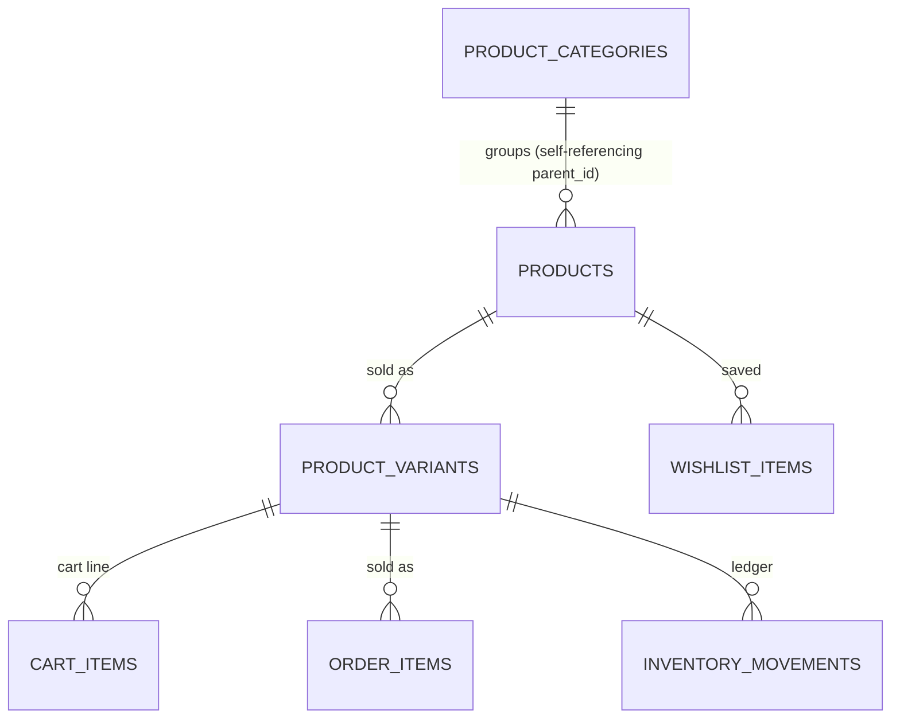
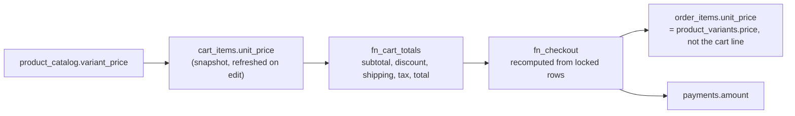

# 08 · Commerce and payments

The boutique sells the hair the salon installs: wigs, extensions, bundles, frontals, hair care and
accessories. It is a small operation with two hard requirements — stock must never go negative, and
the customer must never be charged a number the server did not compute.

---

## The product and variant model



**`products` is the story; `product_variants` is the SKU.** A product carries the marketing content
(`summary`, `description`, `ingredients`, `benefits`, `how_to_use`, `care_instructions`) and the hair
attributes that make it recommendable to a specific client: `hair_class`, `hair_texture`,
`length_cm`, `weight_g`, `cap_construction`, `is_pre_stretched`, `is_glueless`. A variant carries the
commercial facts: `sku` (globally unique), `price`, `compare_at_price`, `cost_price`, the three stock
counters, `low_stock_threshold`, `backorder_allowed`, `weight_grams`, `barcode` and `attributes jsonb`.

The seed shows both shapes in use: `bone-straight-bundle` has a `single` (₦125,000) and a `three`
(₦350,000) variant, while `growth-oil` gets one generated `default` variant at `base_price`.

**`variants_single_default_idx`** guarantees one default variant per product:

```sql
create unique index variants_single_default_idx
  on public.product_variants (product_id) where is_default;
```

The client relies on it: `commerce.ts:collapseVariants` picks `is_default_variant` first, then any
in-stock variant, then the first row — so the product grid always shows a buyable variant.

**`product_catalog` is the anonymous read surface.** It is one row per (product, active variant with
`stock_on_hand > 0`) and it exposes `available_stock` precomputed as
`greatest(stock_on_hand - stock_reserved - safety_stock, 0)`. `collapseVariants` in the client turns
that fan-out back into one card per product, so the grid and the detail page share one query shape.

**The compare-at price is a rule, not a hint.** `products_compare_at_higher check (compare_at_price is
null or compare_at_price > base_price)` means a strikethrough badge is only ever rendered when the
"was" price is genuinely higher, and `discountPercent(price, compare)` in
`src/lib/utils/format.ts` returns `null` for anything else. Editorial control without a UI audit.

---

## The inventory ledger

`stock_on_hand` is a balance; `inventory_movements` is the history. Three mechanisms keep them in
agreement.

**Only two functions may move stock.**

```sql
-- fn_adjust_stock: staff or admin, with a mandatory reason
if not app_private.is_staff_or_admin(auth.uid()) then
  raise exception 'Only staff can adjust inventory' using errcode = 'insufficient_privilege';
end if;
select * into v_variant from public.product_variants where id = p_variant_id for update;
v_new_stock := v_variant.stock_on_hand + p_delta;
if v_new_stock < 0 and not v_variant.backorder_allowed then
  raise exception 'Cannot reduce % below zero (currently %)', …;
end if;
update public.product_variants set stock_on_hand = greatest(v_new_stock, 0) …;
insert into public.inventory_movements (variant_id, product_id, delta, balance_after,
                                        reason, reference_type, reference_id, note, actor_id) …;
```

`backorder_allowed` is per variant, so a made-to-order lace closure can go negative while a shelf item
cannot. `variant_stock_nonneg` enforces the floor at the column level as well.

**A direct update cannot move it.** `guard_variant_columns` raises on any change to `stock_on_hand`,
`price` or `cost_price` for a non-admin, and `inventory_movements` has a `select`-only grant. Both
gates are needed; either alone would be enough for most attackers, and together they make the ledger
authoritative by construction.

**`fn_checkout` decrements and records in the same transaction**, one iteration per cart line,
immediately after writing the `order_items` snapshot:

```sql
update public.product_variants set stock_on_hand = stock_on_hand - v_item.quantity …;
insert into public.inventory_movements (…, delta, balance_after, reason, reference_type, reference_id, actor_id)
values (…, -v_item.quantity, v_variant.stock_on_hand - v_item.quantity, 'sale', 'order', v_order.order_number, v_uid);
```

`balance_after` is the pre-update value minus the quantity, which equals the post-update value —
deliberately computed from the row already in hand rather than re-reading.

Every row carries `delta`, `balance_after`, `reason` (from `inventory_reason`: `sale`, `restock`,
`return`, `adjustment`, `wastage`, `damage`, `transfer`), `reference_type` / `reference_id`, a free-text
`note` and `actor_id`. Any `stock_on_hand` can be explained by replaying the ledger for that variant,
and `AdminInventoryPage` reads it through `admin.ts:listInventoryMovements`.

**Low stock is a scheduled job, not an alert.** `fn_adjust_stock` enqueues
`job_name = 'low_stock_alert'` with the SKU, on-hand and threshold whenever the balance lands at or
below `low_stock_threshold`. Nothing consumes it yet; the payload is already shaped for a
notification worker. `variants_low_stock_idx` is a partial index on
`(stock_on_hand) where is_active and stock_on_hand <= low_stock_threshold`, so the admin dashboard's
low-stock count is an index scan.

**A return restocks the physical units.** `fn_set_order_status(..., 'returned')` writes a positive
`inventory_movements` row per line, increments `stock_on_hand`, and sets `order_items.refunded_qty =
quantity`. The two statements are separate but adjacent in one transaction, and a re-run is
prevented by the `v_order.status <> 'returned'` guard.

---

## Carts and the guest-to-account merge

```mermaid
sequenceDiagram
  autonumber
  participant V as Visitor
  participant C as CartProvider
  participant D as Postgres
  participant P as payments layer

  V->>C: first add
  C->>C: localStorage['uhs:cart-token'] ??= crypto.randomUUID()
  C->>D: fn_get_or_create_cart(token)
  D->>D: auth.uid() is null → cart keyed by session_token
  D-->>C: the cart

  V->>C: signs in
  C->>D: fn_get_or_create_cart(token) with a session
  D->>D: finds the account cart (or creates it)
  D->>D: fn_merge_carts(token, auth.uid())
  D->>D:   for each guest line: INSERT … ON CONFLICT (cart_id, variant_id)
  D->>D:     DO UPDATE quantity = least(existing + incoming, stock_on_hand)
  D->>D:   DELETE the guest cart
  D-->>C: the merged account cart
  Note over C: useEffect invalidates ['cart'] whenever
  isAuthenticated changes, because the authoritative cart may
  have changed identity.
```

Two identities, two partial unique indexes, and a check that a cart is at least one of them:

```sql
constraint cart_identity check (user_id is not null or session_token is not null)
create unique index carts_user_unique_idx    on public.carts (user_id)       where user_id is not null;
create unique index carts_session_unique_idx on public.carts (session_token) where session_token is not null;
```

`fn_get_or_create_cart` writes `session_token` **only** when `auth.uid()` is null, so a cart is never
doubly identified. `fn_merge_carts` caps merged quantities at the variant's `stock_on_hand` and then
deletes the guest cart, so a merge cannot be replayed to inflate a line.

The token is the only thing standing between a stranger and a stranger's basket, which is why it is
never logged, never sent to analytics, and never included in a `action_url`. `CartProvider` generates
it once per browser and keeps it in `localStorage`.

`fn_get_cart(session_token)` is the read path for both identities and is granted to `anon`. It returns
a zeroed payload rather than null when no cart exists, and it adds two computed fields per line that
the client uses for inline warnings:

```sql
greatest(v.stock_on_hand - v.stock_reserved - v.safety_stock, 0) as available_stock,
(v.stock_on_hand - v.stock_reserved - v.safety_stock) < ci.quantity as exceeds_stock
```

So a cart can show "only 2 left" without a second round trip and without the client knowing the stock
formula.

---

## Coupons

`fn_coupon_preview(code, subtotal, product_ids)` is a single `case`-heavy statement that returns a
verdict, a human message and the discount. It never raises, and it is the only place discount
arithmetic exists.

| Rule | Field |
| --- | --- |
| Code is normalised | `upper(trim(coalesce(p_code,'')))`, and `coupons.code` has `check (code = upper(code))` |
| Active window | `starts_at`, `ends_at` |
| Minimum spend | `min_subtotal` → *"Spend ₦25,000 to use this code"* |
| Total cap | `usage_limit` vs `usage_count` → *"This code has been fully redeemed"* |
| Product scope | `product_scope uuid[]` with the `&&` array-overlap operator |
| Category scope | `category_scope text[]` — **defined but not read by the preview**; the checkout function does not filter on it either |
| Value | `percentage` (capped by `max_discount`) or `fixed_amount` (capped by subtotal) |
| `free_shipping` | a third `discount_type` with a value, handled by shipping logic, not by a discount amount — `fn_cart_totals` charges nothing when the subtotal is at or above `free_delivery_threshold`, independently of the coupon |

Every rejection has a matching message, so the promo field can render a reason rather than a
crossed-out box. `fn_apply_cart_coupon` requires authentication (a guest cannot accrue a discount
before creating an account), evaluates the preview, and stores the code only when
`is_valid` — an invalid code is cleared rather than left to fail silently at checkout.
`fn_checkout` increments `usage_count` with its own `where usage_count < usage_limit` guard, so two
concurrent checkouts cannot overshoot a limit.

`FREESHIP` in the seed data is the interesting case: `discount_type = 'free_shipping'` with
`value = 1` and `min_subtotal = 25000`. Because `fn_cart_totals` and `fn_checkout` both waive delivery
whenever the threshold is met, the coupon is effectively redundant in the current logic. It does not
produce an incorrect total; it produces the same total with and without the code.

---

## Server-authoritative pricing

**The client computes no money and trusts no price it was given.** The chain is:



Four independent reasons, each sufficient on its own to justify server-side pricing:

1. **The tax formula depends on configuration the client does not have.** `tax_inclusive` flips the
   divisor between `100 + tax_pct` and `100`. Duplicating that in TypeScript means two
   implementations of one rule.
2. **Coupon eligibility is a data decision.** The preview needs the real subtotal and the real
   product ids.
3. **Stock and price move between render and submit.** `fn_checkout` re-reads
   `product_variants.price` and writes that into `order_items`, not the cart's snapshot.
4. **Floating point cannot be trusted with money.** Postgres `numeric(12,2)` throughout;
   `src/lib/utils/format.ts:formatNaira` only formats a value the server produced.

`TotalsPanel` and `CheckoutSummary` render `CartTotals` verbatim. The only client-side arithmetic in
the commerce path is `discountPercent` (a display percentage) and the quantity stepper.

---

## Tax-inclusive pricing

`business_settings.tax_pct` (default 7.5) and `tax_inclusive` (default `true`) drive it in both
`fn_cart_totals` and `fn_checkout`:

```sql
-- inclusive: the tax is *inside* the line totals, so it is shown separately
-- but must not be added again
round((subtotal - discount) * tax_pct / (100 + tax_pct), 2)

-- exclusive: the tax is added on top
round((subtotal - discount) * tax_pct / 100, 2)
```

The inclusive branch is the standard VAT-inclusive extraction: if a ₦100,000 price contains 7.5% tax,
the tax portion is `100,000 × 7.5 / 107.5 = ₦6,976.74`. The exclusive branch is a straight addition.

Delivery is resolved the same way in both functions:

```sql
case
  when cfg.free_delivery_threshold is null or cfg.free_delivery_threshold <= 0 then 0
  when subtotal >= cfg.free_delivery_threshold                                then 0
  else cfg.standard_delivery_fee
end
```

and then multiplied by `accepts_delivery`, so turning delivery off in settings makes the shipping
line disappear rather than become a zero row. The seed sets a ₦75,000 threshold and a ₦2,500 fee, and
the shipped FAQ matches: *"Delivery is free on orders over ₦75,000 and ₦2,500 otherwise."*

Note that `products.tax_rate` exists as a per-product column and is **not used** by any pricing
function; the singleton rate applies to everything.

---

## The checkout transaction

`fn_checkout(cart_id, contact_name, contact_email, contact_phone, fulfilment_type default 'pickup',
location_id default null, delivery_address default null, notes default null, coupon_code default null)
→ orders`. Required parameters come first in the signature because PostgreSQL forbids a defaulted
parameter before a required one — noted in the migration and in the client wrapper.

Order of operations inside the function, and why:

1. **`auth.uid()` is not null** → `Please sign in to complete your order`. Guest carts must be claimed.
2. **`SELECT … FROM carts WHERE id = p_cart_id FOR UPDATE`** — locks the cart row so two checkouts of
   the same cart cannot both proceed.
3. **Ownership**: `v_cart.user_id is distinct from v_uid and not is_admin(v_uid)` → `Not permitted`.
4. **Non-empty**, delivery enabled, delivery address present for delivery orders.
5. **Optional coupon attachment** (`upper(trim(p_coupon_code))`), so a code can be applied at the last
   moment.
6. **The stock loop** — the important part:

```sql
for v_item in
  select ci.id, ci.variant_id, ci.quantity, ci.unit_price
  from public.cart_items ci
  where ci.cart_id = v_cart.id
  order by ci.variant_id          -- deterministic lock order
  for update
loop
  select * into v_variant from public.product_variants v where v.id = v_item.variant_id for update;
  if v_variant.id is null or not v_variant.is_active then raise … end if;
  if v_variant.stock_on_hand < v_item.quantity and not v_variant.backorder_allowed then raise … end if;
end loop;
```

`order by ci.variant_id` is what makes concurrent checkouts safe. Two carts containing the same two
variants in opposite insertion order would otherwise lock in opposite order and deadlock; sorting by
variant id gives every transaction the same lock sequence. Without it, a deadlock is a livelock risk
in Postgres's deadlock detector's absence — one transaction is killed with `40P01`.

7. **`fn_cart_totals`**, then shipping and tax recomputed from the locked figures.
8. **`INSERT INTO orders`** with `status = 'pending'`, `payment_status = 'awaiting_payment'` (or `'paid'`
   when the total is zero), `location_id` defaulting to the primary active location, and the
   denormalised `contact_name` / `contact_email` / `contact_phone` / `delivery_address`.
9. **Per line:** snapshot into `order_items` (name, variant, SKU, image, attributes, `unit_price`,
   `line_total`, `cost_snapshot`), decrement stock, write the `sale` movement, increment
   `products.sold_count`.
10. **Coupon redemption count.**
11. **Zero-total shortcut:** write a `payments` row with `provider = 'waived'` and `channel =
    'no_payment_required'`. See known issues.
12. **Empty the cart** and clear the coupon, so a refresh cannot replay the order.

Because the whole thing is one `SECURITY DEFINER` call, it is one transaction. Any raise rolls back
the order, the stock movements and the coupon increment together — there is no partial checkout state
to reconcile.

---

## Offline payments and refunds

`fn_record_offline_payment(order_id, amount, provider, reference default null, note default null)
→ payments` covers cash, POS, bank transfer and Moniepoint. It is how the front desk reconciles a
counter sale.

```sql
insert into public.payments (reference, customer_id, order_id, provider, provider_reference,
                             amount, currency, status, purpose, channel, paid_at, verified_at)
values (fn_next_reference('PAY'), v_order.customer_id, p_order_id, p_provider, p_reference,
        p_amount, v_order.currency, 'paid',
        case when p_amount >= v_order.total then 'order' else 'appointment_balance' end,
        p_provider::text, now(), now());

select coalesce(sum(amount), 0) into v_paid
from public.payments where order_id = v_order.id and status in ('paid','partially_paid');

update public.orders
set paid_total   = v_paid,
    refund_total = v_paid - (select coalesce(sum(refunded_amount),0) from public.payments
                             where order_id = v_order.id),
    payment_status = case when v_paid <= 0 then 'unpaid'
                          when v_paid <  v_order.total then 'partially_paid'
                          when v_paid >  v_order.total then 'partially_refunded'
                          else 'paid' end,
    status = case when v_paid >= v_order.total and status = 'pending' then 'confirmed' else status end,
    confirmed_at = case when v_paid >= v_order.total and confirmed_at is null then now() else confirmed_at end
where id = v_order.id;
```

The order's payment state is **always derived** from the sum of its payments, never set
independently. That is why `guard_order_columns` can forbid an admin from editing `paid_total`
without breaking anything: the number is a cache of a sum, and the sum is the truth. Auto-confirming
a fully paid order in the same statement means the front desk does not have to do two things.

It also writes an `audit_log` row: `action = 'payment.recorded'` with the provider, amount and
reference.

**Refunds are a manual, ordered operation, not a function.** There is no `fn_refund`. The design
intent is visible in the guardrails:

- `fn_set_order_status` refuses to cancel an order that has money on it:
  `Refund this order before cancelling it`. Cancelling is a status flip; refunding is a payment event.
- `payment_amount_valid check (refunded_amount <= amount)` bounds a single refund.
- `orders.refund_total` is derived as `paid_total − sum(refunded_amount)`.
- `order_status` includes `refunded`, `partially_refunded` (as a `payment_status`) and `returned`,
  which is where a refund-and-return lands.
- `payments.raw_payload jsonb` exists to hold the provider's signed webhook body "for disputes".

In practice today: a staff member records the refund at the provider, then updates the `payments`
row's `refunded_amount` and `status` (an admin `UPDATE` policy exists, with no column guard — see
[06 · Known gaps](./06-rls-and-permissions.md#known-gaps)), and the order's derived figures follow on
the next reconciliation. Adding a `fn_refund_payment` that mirrors `fn_record_offline_payment` in
reverse would make the ledger uniform.

---

## Paystack integration architecture

**Not implemented.** There is no `supabase/functions/` directory; `paystack-initialize` and
`bank-transfer-instructions` are called by name from `src/lib/api/commerce.ts` and will 404. What
exists is the client half and the entire database half, which is most of the work.

```mermaid
sequenceDiagram
  autonumber
  participant U as Customer
  participant C as CheckoutPage
  participant X as Edge Function (missing)
  participant P as Paystack
  participant D as Postgres

  U->>C: chooses "Pay now"
  C->>X: invoke paystack-initialize { order_id, amount, email, reference: "ORD-<order_number>" }
  Note over X: must re-derive the amount from the orders row
  and create the payments row with provider_reference
  X->>P: transaction/initialize (secret key)
  P-->>X: authorization_url, access_code, reference
  X-->>C: { authorization_url, access_code, reference, amount }
  C-->>U: window.location = authorization_url
  U->>P: card, bank transfer or USSD
  P-->>X: POST webhook charge.success (x-paystack-signature)
  Note over X: verify HMAC over the raw body with the
  secret key. Never trust the amount in the payload.
  X->>D: insert payment_events (provider, event, provider_ref, payload)
  Note over D: unique (provider, event, provider_ref) makes a
  provider retry a no-op
  X->>D: update payments → paid, paid_at, verified_at, raw_payload
  X->>D: recompute orders.paid_total / payment_status / confirmed_at
  X->>D: mark payment_events.processed_at
```

The schema is pre-shaped for exactly this:

| Column / constraint | Purpose |
| --- | --- |
| `payments.provider_reference` + `payments_provider_ref_idx` (partial unique on `(provider, provider_reference)`) | One Paystack reference, one payment row. Makes the webhook idempotent at the business level as well as the log level. |
| `payments.authorization_code`, `access_code` | Paystack's reusable-authorisation fields, for re-charging a saved card. |
| `payments.expires_at` | A transaction that is never completed. |
| `payments.channel` | `card`, `bank`, `ussd`, `bank_transfer`, `mobile_money` — reported by the webhook. |
| `payments.verified_at` | Distinct from `paid_at`: a payment can be paid but not yet verified. |
| `payments.raw_payload jsonb` | *"signed webhook body, for disputes"*. |
| `payments.purpose` | `order`, `appointment_deposit`, `appointment_balance`, `service_balance` — the same table settles appointment deposits. |
| `payment_events` | `(provider, event, provider_ref)` unique, `payload`, `processed_at`, `error`, plus `payment_events_unprocessed_idx (created_at) where processed_at is null`. No policy and no grant: `service_role` only. |
| `orders.payment_status = 'awaiting_payment'` and `orders_unpaid_idx` | The reconciliation worklist. |
| `payments_reconcile_idx (created_at) where status = 'awaiting_payment'` | Rows that were initialised and never completed. |

**Bank transfer** follows the same shape with `provider = 'bank_transfer'` and no webhook: the
`bank-transfer-instructions` function returns the account details and a reference, the customer
transfers, and staff record the payment with `fn_record_offline_payment`. `BankTransferPanel` in
`src/features/checkout/components` is the UI for it, and
`CheckoutPage.requestBankTransfer(order)` is the call.

**Appointment deposits** reuse the same table. `appointments` carries
`deposit_required`, `deposit_amount`, `deposit_paid` and the generated `balance_due`, so the same
`payments.purpose` enum covers a braids deposit and the balance settled at the chair. No Edge Function
is written for the deposit path yet.

---

## Known issues

Four findings, all in the current code.

### 1. The cart total and the order total disagree when prices are tax-inclusive

`fn_cart_totals` ends with:

```sql
greatest(p.subtotal - p.discount_amount + p.tax, 0) + case when cfg.accepts_delivery then p.shipping else 0 end
```

which adds `tax` unconditionally. `fn_checkout` computes:

```sql
v_total := case when v_settings.tax_inclusive
                 then v_totals.subtotal - v_totals.discount + v_shipping
                 else v_totals.subtotal - v_totals.discount + v_tax + v_shipping
             end
```

which adds tax only when it is *not* inclusive. With the default `tax_pct = 7.5` and
`tax_inclusive = true`, a ₦100,000 cart displays a total of ₦107,500 and creates an order for
₦100,000. The order is the correct figure under Nigerian VAT-inclusive pricing; the cart preview
double-counts the tax that is already inside the line prices. The fix is to make `fn_cart_totals`
conditional in the same way `fn_checkout` is — or, better, to have `fn_cart_totals` return the total
the same way for both by construction. Until then, the amount a customer is shown and the amount they
are charged differ by 7.5% of the discounted subtotal.

### 2. A fully discounted order fails its own zero-total branch

```sql
if v_total <= 0 then
  insert into public.payments (…, amount, …) values (…, 0, …);
end if;
```

`payments.amount` carries `check (amount > 0)`. A 100% discount therefore raises `23514` and rolls the
whole checkout back — the customer cannot place a free order. The `provider = 'waived'` row is the
right design; the amount constraint is what blocks it. Either relax the check to `amount >= 0` or skip
the row and let `orders.payment_status = 'paid'` stand on its own.

### 3. `previewCoupon` cannot preview anything

```ts
export async function previewCoupon(code: string): Promise<CouponPreview> {
  return rpc<CouponPreview>('fn_coupon_preview', {
    p_code: code, p_subtotal: 0, p_product_ids: [],
  })
}
```

It passes a zero subtotal and an empty product set, so any coupon with a `min_subtotal` or a
`product_scope` evaluates as invalid regardless of the cart. The live path
(`fn_apply_cart_coupon`) computes both correctly from the cart. `previewCoupon` is currently unreferenced
by any page, so nothing is wrong on screen — but it is a trap for the next caller. The fix is to pass
`cart.totals.subtotal` and the cart's product ids.

### 4. `category_scope` is inert

`coupons.category_scope text[]` is seeded as a documented feature and read by nothing. A category-scoped
coupon behaves as site-wide. The `product_scope` check uses the array-overlap operator
(`c.product_scope && p_product_ids`) and is the pattern the category version should follow; it would
need a `category_ids uuid[]` parameter added through `fn_coupon_preview`, `fn_cart_totals` and
`fn_checkout`.

Two smaller observations, neither a defect: `availableStock(variantId)` and `previewCoupon` are both
exported from `src/lib/api/commerce.ts` and unreferenced by any page, and `fn_checkout` validates
`accepts_delivery` but not `accepts_pickup`, so a salon that closes both channels still accepts
pickup orders.
