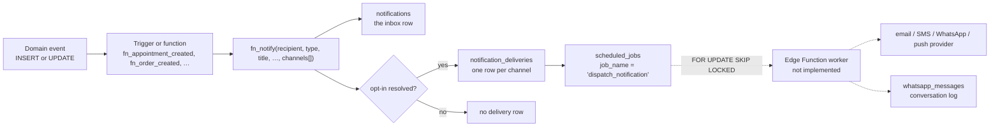
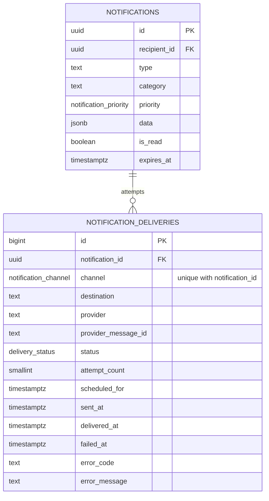

# 09 · Notifications and integrations

The platform's promise is that a customer hears about a booking, a reminder and an order through
several channels, without ever being opted into something they did not ask for, and without the
transactional send sitting inside a database transaction. Migrations 0007 and 0011 implement the
first three of those. The fourth — an actual sender — is not written.



---

## The dispatch model

`fn_notify` is the single entry point for every notification except recruitment submissions. It is
`plpgsql security definer`, granted to `authenticated`, and it does four things in order.

```sql
create or replace function public.fn_notify(
  p_recipient_id uuid,
  p_type         text,                       -- dotted key, e.g. 'appointment.reminder'
  p_title        text,
  p_body         text default null,
  p_category     text default 'general',     -- general|booking|commerce|recruitment|system|promotional
  p_action_url   text default null,
  p_action_label text default null,
  p_priority     public.notification_priority default 'normal',
  p_data         jsonb default '{}',
  p_channels     public.notification_channel[] default array['in_app']
) returns uuid
```

**1. Three early returns, no exceptions.** A null recipient, a missing profile, or a profile whose
`status <> 'active'` all return `null`. A suspended customer must not generate mail, and a
notification failure must never abort the business transaction that triggered it.

**2. One inbox row, always.** The `notifications` insert happens first and unconditionally, because
the in-app inbox is the authoritative record even when every out-of-band channel is suppressed. Its
`type` is a free-text dotted key, so the set of event names is a convention rather than an enum, and
`data jsonb` carries whatever the consumer needs (`appointment_id`, `reference`, `order_number`).

**3. Channel fan-out.** For each requested channel other than `in_app`:

```sql
select coalesce(bool_or(not enabled), false) into v_allowed
from public.notification_preferences np
where np.user_id = p_recipient_id and np.channel = v_channel and np.type in (p_type, '*');

v_allowed := coalesce(not v_allowed, true);          -- no row means default on

if v_is_promotional and not v_profile.marketing_opt_in then v_allowed := false; end if;
if v_channel = 'email'    and not v_profile.email_opt_in    then v_allowed := false; end if;
if v_channel = 'sms'      and not v_profile.sms_opt_in      then v_allowed := false; end if;
if v_channel = 'whatsapp' and not v_profile.whatsapp_opt_in then v_allowed := false; end if;

if v_allowed then
  v_destination := case v_channel
    when 'email'    then v_profile.email
    when 'sms'      then v_profile.phone_e164
    when 'whatsapp' then v_profile.phone_e164
    else null end;

  if v_destination is not null then
    insert into public.notification_deliveries (notification_id, recipient_id, channel,
                                                destination, status)
    values (…, case when v_channel = 'in_app' then 'delivered' else 'queued' end)
    on conflict (notification_id, channel) do nothing;
  end if;
end if;
```

**4. Enqueue exactly once.** If any delivery row is `queued`, a single `scheduled_jobs` row with
`job_name = 'dispatch_notification'` and `payload = {notification_id}` is inserted. The fan-out is
one row per channel and the queue entry is one row per notification, so a three-channel notification
produces three deliveries and one job.

`fn_notify_admins` is a thin loop over `user_roles` where `roles.key = 'admin'`, calling `fn_notify`
for each with `category = 'system'`, `priority = 'high'` and `action_label = 'Open dashboard'`. It is
revoked from clients and called from functions and triggers.

`notifications` is the only table the customer can read, and only their own rows
(`notifications_select_own`). There is deliberately no admin override — see
[06 · Notifications and system](./06-rls-and-permissions.md#notifications-and-system).

---

## Opt-in and opt-out resolution

Four sources, applied in this order. Any one of them can veto a channel.

| Layer | Where it lives | Semantics | Default |
| --- | --- | --- | --- |
| 1. Per-type preference | `notification_preferences` rows with `enabled = false` | "Do not send me `order.status_changed` on email" | No row means on |
| 2. Wildcard preference | `notification_preferences` rows with `type = '*'` | "Do not email me anything" | No row means on |
| 3. Marketing consent | `profiles.marketing_opt_in` | Vetoes `category = 'promotional'` on every channel | `false` — opt-in, not opt-out |
| 4. Channel consent | `profiles.email_opt_in`, `sms_opt_in`, `whatsapp_opt_in` | Per-channel master switch | `email` and `whatsapp` true, `sms` false |

The query in step 3 of `fn_notify` covers layers 1 and 2 in one statement:

```sql
np.type in (p_type, '*')
```

and `bool_or(not enabled)` means *any* matching opt-out wins. That is the correct semantics for
privacy: the most restrictive matching rule governs, and there is no way for a specific-type opt-in
to override a wildcard opt-out, because a row with `enabled = true` and `type = '*'` simply does not
produce a `not enabled` value.

Marketing is deliberately stricter than transactional. `v_is_promotional` is
`p_category = 'promotional'`, and `marketing_opt_in` defaults to **false**, so a promotional
notification to a customer who never ticked the box is not sent on any channel. Transactional
messages use the per-channel switches, which default on for email and WhatsApp because the booking and
order flows depend on them.

The client side is `src/lib/api/account.ts`: `listNotificationPreferences` and
`setNotificationPreference` (an upsert on `(user_id, type, channel)`), plus
`listContactPoints` / `saveContactPoint` / `deleteContactPoint` for the address book. The profile's
four opt-in booleans are edited through the ordinary `updateProfile` call and are not column-guarded
(only `id`, `email` and `status` are), so a customer can opt themselves out of everything.

Two defined mechanisms are not wired to the dispatch path:

- **`quiet_hours jsonb`** (`{ "start": "22:00", "end": "07:00" }`) is stored per
  `(user, type, channel)` and read by nothing. Implementing it properly needs a deferral decision in
  the enqueue step — compute the next permitted `run_after` and enqueue then — rather than in
  `fn_notify`, which has no queue awareness beyond the single `now()` row it writes.
- **An `in_app` preference row** has no effect, because the fan-out loop skips `in_app` entirely. The
  inbox row is written unconditionally.

---

## `notification_deliveries` — one row per attempt channel



`unique (notification_id, channel)` is the idempotency guard: two calls to `fn_notify` for the same
notification cannot produce two email attempts. The worker updates `status`, `provider_message_id`,
the four timestamps, `attempt_count` and the two error columns — enough to answer "did they get it and
what happened when they did not" without a separate log.

`deliveries_queue_idx (scheduled_for) where status in ('queued','processing')` is the claim set.
Customers can read their own rows (`deliveries_select_own_or_staff` also opens all rows to staff) and
there is no write grant at all: deliveries are written by `fn_notify` and by the worker, never by the
browser.

`delivery_status` has seven values; `fn_notify` only ever writes `queued`. `processing`, `sent`,
`delivered` and `read` are provider callbacks, `failed` is a delivery failure, and `suppressed` is
unused — `fn_notify` declines to create the row rather than recording a suppression, which is a
reasonable choice (less to clean up) but means the "we did not email you" story is only visible by
the absence of a row.

---

## The durable job queue

`scheduled_jobs` is the retryable work list. Five columns matter:

| Column | Purpose |
| --- | --- |
| `job_name` | The handler key: `dispatch_notification`, `low_stock_alert`, `appointment_reminder` |
| `payload jsonb` | Everything the handler needs |
| `run_after timestamptz` | When it becomes eligible. Reminders use `starts_at - interval '24 hours'`. |
| `status` | `pending`, `running`, `done`, `failed`, `cancelled` |
| `attempts`, `locked_at`, `locked_by` | The claim protocol and the retry counter |

### Claiming

```sql
create or replace function app_private.claim_scheduled_jobs(p_worker text, p_limit integer default 25)
returns setof public.scheduled_jobs
language sql security definer set search_path = public, pg_temp
as $$
  with claimed as (
    select sj.id
    from public.scheduled_jobs sj
    where sj.status = 'pending'
      and sj.run_after <= now()
      and (sj.locked_at is null or sj.locked_at < now() - interval '10 minutes')
    order by sj.run_after
    limit coalesce(p_limit, 25)
    for update skip locked
  )
  update public.scheduled_jobs sj
  set status = 'running', locked_at = now(), locked_by = p_worker, attempts = sj.attempts + 1
  from claimed
  where sj.id = claimed.id
  returning sj.*;
$$;
```

`FOR UPDATE SKIP LOCKED` is the whole point. It lets N workers poll the same table concurrently and
guarantee that no row is claimed twice: a row another transaction is already locking is skipped rather
than waited on. The `locked_at < now() - 10 minutes` condition is the crash recovery — a worker that
dies mid-job leaves a `running` row, and ten minutes later it becomes claimable again. `attempts`
increments on every claim, so a permanently failing job is visible after one attempt and is deleted
after five.

```sql
create or replace function app_private.complete_scheduled_job(
  p_job_id uuid, p_success boolean, p_error text default null
) returns void
```

sets `status` to `done` or `failed`, stamps `completed_at`, records `last_error` and releases
`locked_at`.

Both are `SECURITY DEFINER` in `app_private` and revoked from every client role. A worker reaches them
with the service-role key, or pg_cron reaches them as the database owner. Migration 0017 grants both
back to `service_role` explicitly, alongside a second pair for the delivery rows themselves.

### Claiming deliveries — the other half of the queue

`claim_scheduled_jobs` handles *job* rows. A dispatcher needs to claim *delivery* rows too, and
migration 0017 adds the primitive:

```
app_private.claim_notification_deliveries(p_limit integer default 40)
  → table (delivery_id bigint, channel, destination, notification_id, recipient_id,
           title, body, attempt_count)
```

```sql
with candidates as (
  select d.id, n.title, n.body
  from public.notification_deliveries d
  join public.notifications n on n.id = d.notification_id
  where d.status = 'queued' and d.scheduled_for <= now() and d.attempt_count < 4
  order by d.scheduled_for
  limit greatest(coalesce(p_limit, 40), 1)
  for update of d skip locked
)
update public.notification_deliveries d
set status = 'processing', attempt_count = d.attempt_count + 1
from candidates c where d.id = c.id
returning …;
```

Three details worth noting. The join to `notifications` is why the function returns `title` and
`body` — the delivery row alone has no message. `FOR UPDATE OF d` locks the delivery and not the
joined notification, so a claim does not block a concurrent read of the inbox. And
`attempt_count < 4` is the retry ceiling: a delivery that has failed four times is never claimed
again, which is the delivery-level equivalent of `housekeeping()`'s five-attempt rule for jobs.

`app_private.recover_stuck_deliveries()` is the crash-recovery counterpart to
`claim_scheduled_jobs`'s 10-minute `locked_at` window. A worker that dies mid-send leaves a row in
`processing`, and this returns it to `queued` once it has been stranded for ten minutes:

```sql
update public.notification_deliveries
set status = 'queued', scheduled_for = now()
where status = 'processing'
  and coalesce(failed_at, sent_at, created_at) < now() - interval '10 minutes';
```

So the queue has two claim primitives, two recovery paths and two attempt ceilings. A dispatcher
Edge Function needs both.

### Housekeeping

```sql
create or replace function app_private.housekeeping() returns jsonb
```

is the single scheduled function. It:

1. calls `purge_expired_holds()` — the only unbounded-growth table in the booking path;
2. deletes `scheduled_jobs` where `status = 'done'` and `completed_at < now() - 7 days`;
3. deletes `scheduled_jobs` where `status = 'failed'` and `attempts >= 5`;
4. deletes `notifications` where `expires_at` is not null and in the past;
5. returns `{"holds_purged": n, "jobs_cleaned": m}`.

The cron registration is not in the migrations. `supabase/config.toml` carries it commented out, which
is the intended operator step:

```sql
select cron.schedule('uhs-housekeeping', '*/10 * * * *', $$select app_private.housekeeping();$$);
select cron.schedule('uhs-dispatch-notifications', '* * * * *',
                     $$select app_private.claim_scheduled_jobs('pg_cron', 50);$$);
```

Both are listed in the runbook. The second one only *claims* jobs; discarding the result without a
sender is harmless, and it is a useful way to watch the queue drain in staging.

---

## Appointment reminders

`fn_appointment_created` enqueues two reminder jobs at booking time, not a recurring scan:

```sql
insert into public.scheduled_jobs (job_name, payload, run_after)
values
  ('appointment_reminder', jsonb_build_object('appointment_id', v_appt.id, 'offset', '24h'),
   v_appt.starts_at - interval '24 hours'),
  ('appointment_reminder', jsonb_build_object('appointment_id', v_appt.id, 'offset', '2h'),
   v_appt.starts_at - interval '2 hours');
```

`run_after` is computed in the appointment's own absolute time, so the queue is timezone-free and a
reminder cannot drift by a DST shift. Both jobs are created in the same transaction as the
appointment, so a booking that rolls back takes its reminders with it.

Two consequences of the design: a booking created less than 24 hours ahead has a reminder whose
`run_after` is already in the past, so it becomes immediately claimable and fires on the next poll; and
nothing re-enqueues a reminder when an appointment is rescheduled or cancelled. A reschedule creates a
*new* appointment, so the new one gets its own pair; a cancellation leaves the old pair to be claimed
and skipped by the handler (which should check the current status before sending — the payload only
carries the id).

`fn_appointment_created` also notifies the customer on `in_app`, `email` and `whatsapp` with
`priority = 'high'`, formats the start time in `Africa/Lagos` regardless of the server timezone, and
calls `fn_notify_admins` with an `/admin/bookings/{id}` deep link.

The `offset` in the payload exists so one handler can serve both jobs and pick the right template:
migration 0015 seeds `appointment.reminder_24h` (email) and `appointment.reminder_2h` (SMS) as
separate `message_templates` rows.

---

## Message templates

`message_templates(key unique, channel, locale default 'en-NG', subject, body, variables text[],
is_active, updated_at)`. Six rows are seeded:

| key | channel | subject |
| --- | --- | --- |
| `appointment.confirmation` | email | `Your booking at Black Chery Unisex Studio is confirmed ({{reference}})` |
| `appointment.reminder_24h` | email | `See you tomorrow, {{first_name}}` |
| `appointment.reminder_2h` | sms | null |
| `order.confirmation` | email | `Order {{order_number}} received` |
| `order.ready` | whatsapp | null |
| `application.received` | email | `We received your application for {{job_title}}` |

`variables text[]` documents the placeholders each template expects — `{{first_name}}`,
`{{reference}}`, `{{service_name}}`, `{{starts_at}}`, `{{staff_name}}`, `{{location_address}}`,
`{{order_number}}`, `{{item_count}}`, `{{total}}`, `{{fulfilment}}`, `{{location_name}}`,
`{{job_title}}`, `{{full_name}}` — which is the contract between whoever edits a template and whoever
renders it. The `{{mustache}}` style is a convention, not a library dependency: nothing in the
migrations substitutes them, because rendering is the sender's job.

`fn_notify` does **not** use `message_templates`. It writes its message text inline, built with
`format()` in `fn_appointment_created`, `fn_order_created` and `fn_set_order_status`. The templates
are the outbound path (email bodies, SMS, WhatsApp) and are what a notification worker would read;
the inbox copy is written separately. The duplication is deliberate — the in-app message can be short
and link-driven, the email can be long — but it does mean a template edit does not change the in-app
copy and vice versa.

Templates are admin-only: `templates_admin_only` is `for all` on `authenticated` with
`fn_is_admin()`, and the table is in the admin write grant list.

---

## WhatsApp Cloud API — planned

**Not implemented.** The schema, the opt-in plumbing and the conversation log all exist; the sender
does not. The plan the schema anticipates:

**The 24-hour window.** Meta's Cloud API allows free-form replies only inside 24 hours of the
customer's last inbound message. Outside it, a business-initiated message must use a pre-approved
**template**. That constraint is visible in the design:

- `whatsapp_messages.template_name` is nullable and exists precisely so a message can record which
  template was used.
- The seeded templates include channel-specific entries for exactly the messages that fall outside the
  window: `order.ready` is a `whatsapp` template, and `appointment.reminder_24h` / `_2h` are
  transaction-shaped and would need template approval if the customer has not messaged in.
- `profiles.whatsapp_opt_in` defaults to `true`, and `fn_notify` treats WhatsApp as an ordinary
  channel that needs an explicit opt-out. Marketing messages additionally require
  `marketing_opt_in`.

**Opt-in requirements.** WhatsApp Business requires affirmative opt-in before any business-initiated
message. The platform satisfies this with `profiles.whatsapp_opt_in` plus per-type
`notification_preferences` rows, both readable and writable by the customer. A registration flow that
captures a template-based opt-in message and records the timestamp is not built;
`profiles.phone_verified_at` and `contact_points.verified_at` are the columns waiting for it.

**The conversation log.** `whatsapp_messages(provider_message_id text unique, direction check in
('inbound','outbound'), profile_id, appointment_id, order_id, template_name, body, status,
error_message, sent_at, delivered_at, read_at)` is the webhook target: Meta's status callbacks update
`delivered_at` / `read_at`, and an inbound message arrives as a `direction = 'inbound'` row that
resets the 24-hour window. `whatsapp_profile_idx (profile_id, sent_at desc)` supports a transcript
view. Policies today: participants and staff can read, staff can insert; there is no client table
grant, so the log is written by the sender.

**The flow a sender would implement.**

1. `claim_scheduled_jobs('whatsapp-worker', 25)`.
2. For `dispatch_notification`, load the `notification_deliveries` rows with
   `channel = 'whatsapp' and status = 'queued'`, and the `message_templates` row matching
   `(key, channel, locale)`.
3. If the customer last messaged inside 24 hours, send free text; otherwise send the template name.
4. POST `https://graph.facebook.com/v18.0/{phone-number-id}/messages` with the bearer token from the
   Edge Function environment — never from the browser, and never from SQL.
5. Write the `whatsapp_messages` row with `provider_message_id` and `status`, update the delivery row,
   then `complete_scheduled_job`.

Secrets placement, per `.env.example`: `VITE_WHATSAPP_PHONE_NUMBER` is public and safe in the bundle;
the token, the phone-number id and the template ids must be Supabase Edge Function environment
variables. The `.env.example` comment says so explicitly: *"server-only secret must live in Supabase
Edge Function env, never in VITE_\* — VITE_ vars are public in the bundle"*.

---

## Known gaps

- **No sender exists.** `dispatch_notification` and `low_stock_alert` jobs accumulate in
  `scheduled_jobs` and are never claimed in any environment. `app_private.housekeeping()` will delete
  them only if they complete; `failed` jobs accumulate until they reach five attempts, which they
  never will. Migration 0017 added the claiming primitives the sender would call
  (`claim_notification_deliveries`, `recover_stuck_deliveries`) but nothing calls them.
- **No cron is registered.** Both `cron.schedule` statements are commented out in
  `supabase/config.toml`, so `housekeeping()` is never called and `booking_holds` grows without bound.
- **Guest applicants are never notified.** `fn_application_submitted` builds its confirmation with
  `insert … select … from public.profiles p where p.id = v_app.applicant_id`, so an applicant who
  applied without an account (`applicant_id is null`, which `fn_submit_application` explicitly
  supports) gets no confirmation and no email. The `on conflict do nothing` on that insert is also
  inert, because `notifications` has no unique constraint to conflict on.
- **Quiet hours are stored and ignored** (see above).
- **Reminders are not cancelled.** A cancelled or rescheduled appointment leaves its reminder jobs
  queued; the handler must re-check the appointment status before sending.
- **`fn_notify` never writes an `in_app` delivery row**, because the fan-out loop skips that channel.
  The `case when v_channel = 'in_app' then 'delivered'` branch inside the loop is therefore
  unreachable, and the `delivery_status = 'suppressed'` value is never written by anything.
- **No push channel.** `notification_channel.push` exists in the enum and nothing enqueues it;
  there is no service worker, no `push` table and no VAPID configuration.
