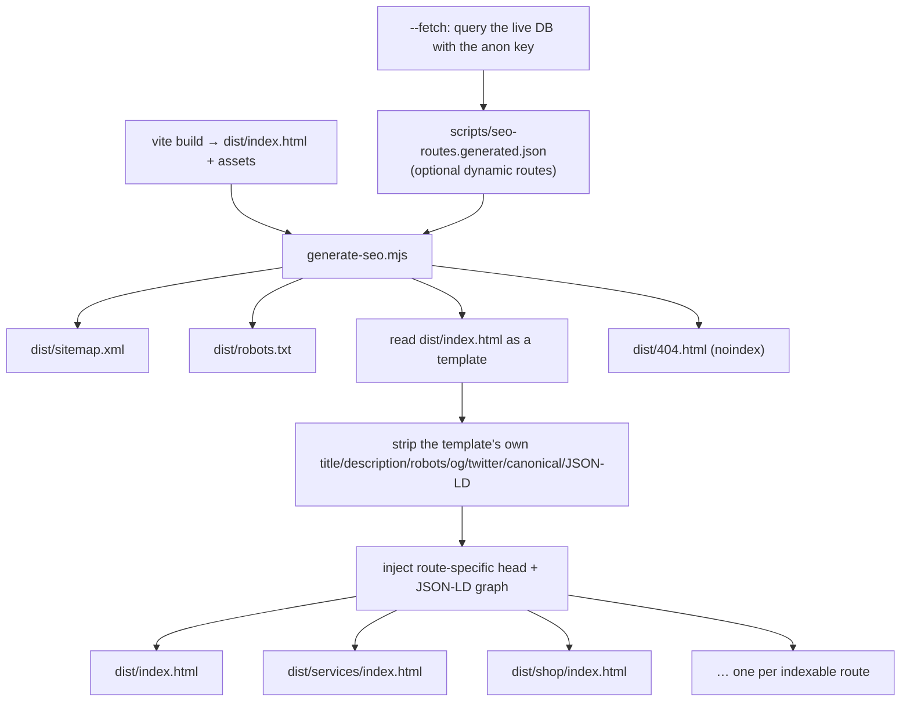

# 10 · SEO and analytics

Two concerns, one principle: **describe the page twice, in two places that must agree.** A crawler's
first fetch sees static HTML; a crawler's Java pass and a human's browser see the head after
`useSeo` has run. `scripts/generate-seo.mjs` exists so the first of those is not empty.

---

## The head manager

`src/components/seo/Seo.tsx` exports one hook, `useSeo`, plus seven schema builders. There is no
helmet-style library, because the hard part here is not setting tags — it is *removing* them.

```ts
export interface SeoProps {
  title: string
  description?: string
  path?: string                  // absolute path, e.g. '/services/knotless-braids'
  image?: string
  type?: 'website' | 'article' | 'product' | 'profile'
  noindex?: boolean
  nofollow?: boolean
  jsonLd?: Record<string, unknown> | Record<string, unknown>[]
  bareTitle?: boolean            // suppress the "| Unisex Hair Studio" suffix
}
```

### Avoiding tag leakage

The failure mode in a SPA is navigation, not mount. React Router does not reload the document, so a
route that forgets to clear a tag leaves it behind for the next route: a product page inherits the
service page's canonical, or a service page keeps the previous service's `Product` JSON-LD and ends up
claiming a wig it does not sell. Both are the kind of inconsistency that gets a rich result
suppressed, and neither is visible in a browser.

Three mechanisms prevent it:

1. **`data-seo-managed`.** Every tag the hook creates carries `data-seo-managed=""`. `upsertMeta` and
   `upsertLink` look for an existing tag by selector first and update it, so re-running the effect
   never duplicates. The attribute is the handle an external audit or a future server render can use
   to identify what belongs to the head manager and what is hand-authored in `index.html`.
2. **A module-level registry for JSON-LD.**

```ts
let jsonLdTags: HTMLScriptElement[] = []

function replaceJsonLd(nodes) {
  for (const tag of jsonLdTags) tag.remove()
  jsonLdTags = []
  if (!nodes) return
  for (const node of Array.isArray(nodes) ? nodes : [nodes]) {
    const script = document.createElement('script')
    script.type = 'application/ld+json'
    script.setAttribute(MANAGED, '')
    try {
      script.textContent = JSON.stringify(node)
      document.head.appendChild(script)
      jsonLdTags.push(script)
    } catch {
      if (import.meta.env.DEV) console.warn('[seo] invalid JSON-LD node', node)
    }
  }
}
```

Structured data is the one tag type that cannot be "upserted" by selector — there is no key to match
on — so it is fully replaced on every run, and a node that fails to serialise is dropped with a
development-mode warning rather than breaking the render.
3. **Idempotent upserts for everything else.** `document.title`, `meta[name=description]`,
   `meta[name=robots]`, `link[rel=canonical]`, seven Open Graph properties and five Twitter tags are
   all written through `upsertMeta` / `upsertLink`, so their values are always whatever the current
   route passed.

### What it writes

```ts
document.title = bareTitle ? title : `${title} | ${site.name}`

upsertMeta('meta[name="description"]', 'name', 'description', description ?? site.shortDescription)
upsertMeta('meta[name="robots"]', 'name', 'robots',
  `${noindex ? 'noindex' : 'index'}, ${nofollow ? 'nofollow' : 'follow'}, max-image-preview:large`)
upsertLink('canonical', absoluteUrl(path ?? window.location.pathname))

// og:title og:description og:url og:type og:site_name og:image og:locale
// twitter:card=summary_large_image, twitter:title, twitter:description, twitter:image
```

`og:locale` is derived from `site.locale.replace('-', '_')` → `en_NG`. The default image is
`absoluteUrl('/og-image.jpg')`, overridable per page — which is why a product page should pass its own
photograph once photography exists.

The effect's dependency array includes every value it reads, including the `jsonLd` object itself.
That is why the contract says to build JSON-LD with `useMemo` when it depends on fetched data: an
inline object literal in the props would re-serialise and re-append the tags on every render.

`noindex` is how a page opts out without leaving the sitemap — `PolicyPage` and the auth pages use it;
`NotFoundPage` sets it, and `generate-seo.mjs` also stamps `noindex` on the 404 shell.

---

## Structured data builders

All seven live in `Seo.tsx` and all emit `@context: https://schema.org`. They are plain functions, not
hooks, so a page can compose an array and hand it to `useSeo` in one call.

### `organizationSchema()` — `HairSalon`

The local-business node every other builder references by `@id`.

```json
{
  "@context": "https://schema.org",
  "@type": "HairSalon",
  "@id": "https://unisexhairstudio.com/#studio",
  "name": "Unisex Hair Studio",
  "legalName": "Unisex Hair Studio",
  "description": "A premium unisex salon for braids, locs, hair, colour and styling — with an online boutique.",
  "url": "https://unisexhairstudio.com",
  "telephone": "+2348000000000",
  "email": "hello@unisexhairstudio.com",
  "priceRange": "₦₦",
  "currenciesAccepted": "NGN",
  "paymentAccepted": "Credit Card, Bank Transfer, USSD, Mobile Money, Cash",
  "address": {
    "@type": "PostalAddress",
    "streetAddress": "12 Adeola Odeku Street",
    "addressLocality": "Victoria Island",
    "addressRegion": "Lagos",
    "postalCode": "106104",
    "addressCountry": "NG"
  },
  "sameAs": ["https://instagram.com/unisexhairstudio", "…/facebook", "…/tiktok", "…/x"]
}
```

`HairSalon` is a schema.org subtype of `LocalBusiness`, which is what makes it eligible for a local
pack result. `paymentAccepted` lists the providers the platform actually supports, which is the
`payment_provider` enum rendered as prose. A near-identical node is also hard-coded in `index.html` so
it survives a JavaScript-less fetch; `generate-seo.mjs` strips that one and re-emits its own.

### `breadcrumbSchema(trail)` — `BreadcrumbList`

```ts
breadcrumbSchema([
  { name: 'Home', path: '/' },
  { name: 'Services', path: '/services' },
  { name: 'Knotless Braids', path: '/services/knotless-braids' },
])
// → itemListElement: ListItem[] with 1-based position and absolute item URLs
```

Positions are `index + 1` because schema.org `position` is 1-based. The builder takes the path and
calls `absoluteUrl` itself, so call sites cannot produce a relative URL.

### `serviceSchema(input)` — `Service`

```json
{
  "@type": "Service",
  "name": "Knotless Braids",
  "description": "Long-lasting knotless braids with a seamless, natural finish.",
  "url": "https://unisexhairstudio.com/services/knotless-braids",
  "serviceType": "Hair salon",
  "provider": { "@type": "HairSalon", "@id": "https://unisexhairstudio.com/#studio" },
  "areaServed": { "@type": "City", "name": "Lagos" },
  "offers": {
    "@type": "AggregateOffer",
    "priceCurrency": "NGN",
    "lowPrice": 45000,
    "highPrice": 140000,
    "offerCount": 2
  },
  "estimatedDuration": "PT300M"
}
```

`AggregateOffer` with `lowPrice` / `highPrice` is the right shape for a service with a price band
(`services.price_from` / `price_to`), and `offerCount` reflects whether a band exists.
`estimatedDuration` is ISO 8601 from `duration_minutes` and is omitted when the duration is falsy.
`provider` points at the same `@id` as the organisation node, which is what links the page to the
business entity.

### `productSchema(input)` — `Product`

```json
{
  "@type": "Product",
  "name": "Glueless Bob Wig",
  "url": "https://unisexhairstudio.com/shop/glueless-bob-wig",
  "sku": "UHS-GLUELESS-STD",
  "brand": { "@type": "Brand", "name": "Unisex Hair Studio" },
  "offers": {
    "@type": "Offer",
    "url": "…/shop/glueless-bob-wig",
    "priceCurrency": "NGN",
    "price": 185000,
    "availability": "https://schema.org/InStock",
    "itemCondition": "https://schema.org/NewCondition"
  },
  "aggregateRating": { "@type": "AggregateRating", "ratingValue": 4.8, "reviewCount": 26 }
}
```

`availability` is derived from `product_catalog.available_stock` (which already subtracts reserved and
safety stock), so the structured data cannot claim an out-of-stock item is available.
`aggregateRating` is emitted only when both a rating and a count exist, because a rating with no
review count is invalid and risks a manual action. Optional fields are `undefined` rather than
`null`, so `JSON.stringify` omits them entirely.

### `jobSchema(input)` — `JobPosting`

```json
{
  "@type": "JobPosting",
  "title": "Senior Braids Artist",
  "description": "Lead our braids book across knotless, box and stitch work.",
  "url": "https://unisexhairstudio.com/careers/senior-braids-artist",
  "datePosted": "2026-09-28",
  "employmentType": "FULL TIME",
  "hiringOrganization": { "@type": "Organization", "name": "Unisex Hair Studio", "sameAs": "…" },
  "jobLocation": { "@type": "Place", "address": { "@type": "PostalAddress", "addressLocality": "Victoria Island", "addressRegion": "Lagos", "addressCountry": "NG" } },
  "baseSalary": {
    "@type": "MonetaryAmount", "currency": "NGN",
    "value": { "@type": "QuantitativeValue", "minValue": 120000, "maxValue": 220000, "unitText": "MONTH" }
  }
}
```

`employmentType` is derived from the `employment_type` enum with `replace('_', ' ').toUpperCase()` →
`FULL_TIME` → `FULL TIME`, which is what Google's job-posting guidance asks for. `baseSalary` is
emitted only when `salary_min` is set, and the seed's `is_disclosed = false` convention lets an admin
publish a "Competitive" ad by leaving both salary columns null — in which case the property is
omitted rather than faked. `datePosted` comes from `published_at`.

### `faqSchema(faqs)` — `FAQPage`

```json
{
  "@type": "FAQPage",
  "mainEntity": [
    { "@type": "Question", "name": "How far in advance can I book?",
      "acceptedAnswer": { "@type": "Answer", "text": "Bookings open 60 days ahead…" } }
  ]
}
```

The content comes from the `faqs` table, filtered to `is_published` by RLS, and the answers on the
page are rendered by the same `FaqList` component — so the structured data and the visible text are
the same strings, which is the requirement that matters for a FAQ rich result.

### `reviewSchema(reviews)` — `Product` with a `review` array

```json
{
  "@type": "Product",
  "review": [
    { "@type": "Review",
      "reviewRating": { "@type": "Rating", "ratingValue": 5, "bestRating": 5, "worstRating": 1 },
      "name": "Best braids in Lagos, hands down…",
      "reviewBody": "…",
      "author": { "@type": "Person", "name": "Ada O." },
      "datePublished": "2026-08-14" }
  ]
}
```

`name` is the first 60 characters of the body, because a `Review` without a headline is incomplete and
Google expects one. Anonymous authors fall back to `"Unisex Hair Studio client"` rather than being
omitted, since a `Person` with no name is not valid. Only `status = 'published'` reviews are visible to
the page at all, because that is the RLS filter.

### Composing them

`useSeo` takes one node or an array, so a page passes a graph:

```tsx
const jsonLd = useMemo(() => [
  organizationSchema(),
  breadcrumbSchema([{ name: 'Home', path: '/' }, { name: 'Services', path: '/services' }]),
  serviceSchema({ name: service.name, description: service.summary, slug: service.slug,
                  priceFrom: service.price_from, priceTo: service.price_to,
                  durationMinutes: service.duration_minutes, image: service.image_url }),
], [service])

useSeo({ title: service.name, description: service.summary,
         path: `/services/${service.slug}`, image: service.image_url, jsonLd })
```

`HomePage` and `AboutPage` pair `organizationSchema()` with a breadcrumb, and add `faqSchema` when
`faqs` is non-empty. `ContactPage` and `CareersPage` do the same. `CheckoutPage` and
`CheckoutSuccessPage` call `useSeo` with `noindex` so transaction pages never enter an index.

---

## The prerendering step

`scripts/generate-seo.mjs`, run as the last stage of `npm run build`
(`tsc -b --noEmit && vite build && npm run seo:generate`).



**Why this matters.** A client-rendered SPA ships one `index.html` with an empty `<div id="root">`.
Google renders JavaScript and usually copes, but a meaningful share of crawlers, link unfurlers,
chat-app previews, social scrapers and every non-Google search engine do not. For a Lagos salon
competing on local search, being legible to those fetchers is worth a build step.

**What it emits.**

- `sitemap.xml` — one `<url>` per route with `<loc>`, `<lastmod>`, `<changefreq>` and `<priority>`,
  XML-escaped. Twelve curated static routes carry hand-written titles, descriptions, priorities
  (`/` at 1.0, `/services` and `/book` at 0.95, policies at 0.3–0.4) and a breadcrumb trail.
- `robots.txt` — `Allow: /`, then `Disallow` for `/account`, `/staff`, `/admin`, `/checkout`, `/auth`,
  `/cart` and `/search`, plus query-string exclusions for `sort=` and `q=`, and a `Sitemap:` line.
- Per-route shells — `<route>/index.html`, each with the template's own metadata **stripped** first
  (all `meta[name=description|robots]`, all `og:*`, all `twitter:*`, the canonical link and the baked
  JSON-LD block) and a single complete set injected in their place. The comment in the script explains
  why: *"otherwise every shell would ship two conflicting Organization nodes and duplicate Open Graph
  tags, which is exactly the kind of inconsistency that gets a rich result suppressed."*
- `404.html` with `noindex, follow`.

The shells are pure static HTML. No bundler, no SSR runtime, no new dependency. The runtime is
expected to overwrite them: the script's comment says *"`useSeo` overwrites them on hydration, which
is the intended behaviour."*

**Dynamic routes.** Eleven routes are curated (home, about, services, book, shop, gallery, careers,
contact and three policies). Service, product and job detail pages are the long tail — in the seed
alone, 17 services and 10 products — and they are not in the static list. Two options:

```bash
node scripts/generate-seo.mjs --fetch   # queries services, products and jobs with the anon key
```

`--fetch` reads `VITE_SUPABASE_URL` and `VITE_SUPABASE_ANON_KEY`, selects active services, active
products and open jobs through the same public policies the site uses, and writes
`scripts/seo-routes.generated.json` — a per-route record of path, changefreq, priority, `lastmod`
(from `updated_at` / `published_at`), title, description, breadcrumb trail and JSON-LD nodes. A
subsequent run without `--fetch` picks that file up, so a build in CI needs no database access. Without
the file, dynamic pages fall back to the runtime `<head>`, which is a degradation, not a failure.

The generated JSON-LD in the script is a second, independent implementation of the schema builders
(`Service`, `Product`, `JobPosting` and the organisation node). It is written out longhand rather than
imported from the TypeScript because the script runs in plain Node with no build step; the
organisation node is duplicated across three places — `src/config/site.ts`, `Seo.tsx`,
`generate-seo.mjs` — plus the hard-coded copy in `index.html`, and all four must be kept in step.

**Static assets the shells reference.** `index.html` links `/favicon.svg`, `/apple-touch-icon.png`,
`/manifest.webmanifest` and `/og-image.jpg`; `manifest.webmanifest` additionally references
`/icon-192.png` and `/icon-512.png`. Only `public/favicon.svg` and `public/manifest.webmanifest`
exist. The missing images mean a broken social preview and an incomplete install manifest — a
launch-blocking item, listed in the runbook.

**Note on `dist/`.** The generator reads `dist/index.html`, so it must run *after* `vite build`; if
the file is missing it logs `dist/index.html not found — run vite build first; skipping prerender` and
exits cleanly. `vite preview` and any static host need a rewrite of extensionless paths to
`/index.html` for client-side routes that were not prerendered.

---

## Migration path to SSR or ISR

The current approach is a bolt-on: correct tags for non-JavaScript fetchers, real rendering for
everyone else. When the catalogue grows, three options in increasing order of cost:

1. **Keep prerendering, widen it.** Run `--fetch` in CI on every deploy so detail pages get shells
   too, and add a `revalidate` step that re-runs the generator on a schedule. Cost: the shells go
   stale between runs, and the repository grows by one file per product.
2. **ISR at the edge** (Next.js, or Astro with an adapter). The catalogue is a perfect fit: it changes
   on the order of hours, it is read-heavy, and every page is already data-driven from
   `service_catalog` / `product_catalog`. Revalidate on `services.updated_at` / `products.updated_at`
   rather than on a timer. Cost: a framework migration, and the Vite-only build script becomes
   framework-specific.
3. **Full SSR.** The one thing it buys over ISR is per-request freshness, which a salon booking flow
   does not need — and it costs a server or edge runtime in the request path.

The migration is cheap in the way that matters: `useSeo` already receives every value a server
renderer would need (title, description, path, image, noindex, and the JSON-LD graph), and the
`data-seo-managed` attribute identifies exactly which tags are runtime-managed. The generator's own
header says the plan: *"If you later migrate to SSR or ISR, delete step 3 and keep steps 1-2."*
`sitemap.xml` and `robots.txt` remain valid in all three.

---

## Analytics

`src/lib/analytics.ts`. Provider-agnostic, consent-first, and typed.

### Consent

```ts
const CONSENT_KEY = 'uhs:analytics-consent'
type Consent = 'granted' | 'denied' | 'unknown'

export function getConsent(): Consent { … localStorage … }
export function hasAnalyticsConsent(): boolean { return getConsent() === 'granted' }
export function setConsent(consent: 'granted' | 'denied'): void {
  localStorage.setItem(CONSENT_KEY, consent)
  if (consent === 'granted') { loadScripts(); trackPageView(location.pathname + location.search, document.title) }
}
```

Three properties, and they are the point of the module:

- **Nothing loads before consent.** `loadScripts()` is the only function that injects a `<script>`, and
  it is called from exactly two places, both guarded: `setConsent('granted')` and `initAnalytics()` when
  consent is already granted. There is no third-party byte on the wire for a visitor who has not
  opted in.
- **`trackEvent` and `trackPageView` are no-ops without consent.** `trackEvent` returns before touching
  `window.dataLayer`; `trackPageView` additionally requires `window.gtag` to exist. Calling analytics
  from a component is therefore always safe.
- **No identifier is created that cannot be deleted.** The module's header says so. GA4 is configured
  with `anonymize_ip: true`; Plausible is cookieless by design; the only persistent key is the consent
  string in `localStorage`, which a user can clear.

`initAnalytics()` is called once in `main.tsx` before `createRoot`, and logs to the console in
development when it is waiting for consent.

### Providers

Both are optional and both can be enabled together; `env.analytics.enabled` requires
`VITE_ENABLE_ANALYTICS=true` **and** at least one id.

```ts
if (env.analytics.gaId) {
  const script = document.createElement('script')
  script.async = true
  script.src = `https://www.googletagmanager.com/gtag/js?id=${env.analytics.gaId}`
  document.head.appendChild(script)

  window.dataLayer = window.dataLayer || []
  window.gtag = (...args) => { window.dataLayer.push({ gtag: args }) }   // positional shim
  window.gtag('js', new Date())
  window.gtag('config', env.analytics.gaId, { anonymize_ip: true, send_page_view: false })
}

if (env.analytics.plausibleDomain) {
  const script = document.createElement('script')
  script.defer = true
  script.dataset.domain = env.analytics.plausibleDomain
  script.src = 'https://plausible.io/js/script.js'
  document.head.appendChild(script)
}
```

Two details worth copying elsewhere. `send_page_view: false` because a SPA's initial load is reported
by the app, not by the gtag snippet, and letting both fire double-counts every session start. The
`gtag` shim exists because gtag takes positional arguments while `dataLayer` entries are objects; the
shim wraps them so a single event shape reaches both GTM and GA4.

### Page views on SPA navigation

```ts
// main.tsx
window.addEventListener('popstate', () => {
  trackPageView(window.location.pathname + window.location.search, document.title, site.url)
})
```

This is a partial solution and is described as such in the code comment. `popstate` fires for back and
forward, not for a `Link` click, so forward navigation is covered by the router and backward
navigation by this listener. A `useLocation` effect inside the router would cover both; the current
arrangement works because the analytics module is deliberately outside React and therefore outside
`BrowserRouter`.

### The event vocabulary

One exported object, so a measurement name changes in exactly one place.

| Method | GA4 event | Payload |
| --- | --- | --- |
| `viewService(slug, name, price)` | `view_item` | `item_id`, `item_name`, `value` |
| `viewProduct(slug, name, price)` | `view_item` | same |
| `bookingStarted(serviceSlug, price?)` | `begin_booking` | `service`, `value` |
| `slotSelected(serviceSlug, startsAt)` | `select_slot` | `service`, `slot` |
| `bookingCompleted(reference, value)` | `purchase` | `transaction_id`, `currency: 'NGN'`, `value` |
| `bookingCancelled(reference)` | `cancel_booking` | `transaction_id` |
| `addToCart(slug, value, qty)` | `add_to_cart` | `item_id`, `value`, `quantity` |
| `removeFromCart(slug, value, qty)` | `remove_from_cart` | same |
| `beginCheckout(value, items)` | `begin_checkout` | `value`, `items` |
| `search(term, category?)` | `search` | `search_term`, `item_category` |
| `jobApplicationStarted(slug)` | `begin_application` | `job` |
| `jobApplicationSubmitted(slug)` | `application_submitted` | `job` |
| `signUp(method)` | `sign_up` | `method` |
| `signIn(method)` | `login` | `method` |
| `share(method, content)` | `share` | `method`, `content_type` |
| `whatsappClick(context)` | `whatsapp_click` | `context` |

Two conventions are visible in the table. `transaction_id` is the business reference
(`appointments.reference` / `orders.order_number`), not an internal uuid, so a refund or a cancellation
in the database can be reconciled with the analytics record. `currency` is hard-coded to `'NGN'`,
matching `business_settings.currency`.

Events are also pushed to `window.dataLayer` unconditionally (after the consent check), so a Google
Tag Manager container can pick them up with no change to call sites.

### Privacy boundaries

No event carries an email address, a phone number, a name or a user id. The strongest identifier in the
vocabulary is a product slug, a service slug and a business reference. `analytics.whatsappClick` is a
click counter, not a message tracker. The `uhs:analytics-consent` key is the only thing written to
storage, and `CartProvider`'s `uhs:cart-token` is never sent anywhere.

---

## Known gaps

- **The prerendered shells reference three images that do not exist**: `/og-image.jpg`,
  `/apple-touch-icon.png`, and the manifest's `/icon-192.png` and `/icon-512.png`. Social previews and
  the install manifest are incomplete until they are added to `public/`.
- **Dynamic detail pages are not in the sitemap** unless `npm run seo:generate -- --fetch` has been run
  with database credentials. The build script does not pass `--fetch`, so a CI build emits the twelve
  curated routes only.
- **Four copies of the organisation node** must be kept in step: `index.html`,
  `src/components/seo/Seo.tsx:organizationSchema()`, `scripts/generate-seo.mjs:organizationNode()` and
  the opening hours implied by `src/config/site.ts` / `location_hours`. There is no test asserting they
  agree.
- **Page views are reported from a `popstate` listener**, so a client-side navigation is only counted
  if `trackPageView` is also called by the route. A router-level effect would be the robust form.
- **No consent UI is wired.** `setConsent` exists and is correct, but there is no banner component in
  `src/`; the notice in `App.tsx` is about mock mode, not cookies. Until it exists, analytics stays off
  in any environment where consent has not been granted — which is the safe default, but it also means
  the feature is effectively dormant.
- **`reviewSchema` is defined and not called** by any page today, so no `review` rich result is
  emitted.
- **The `data-seo-managed` attribute is set but never queried** — no audit script exists to detect
  leakage, which is the failure mode the whole module was designed to prevent.
